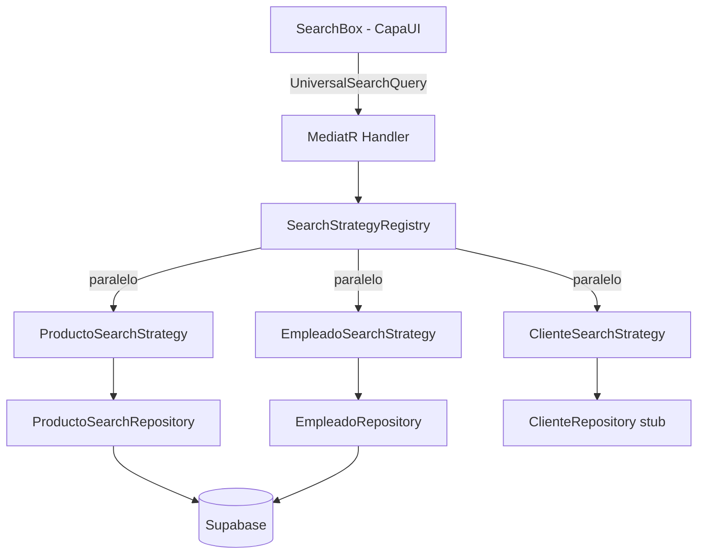

# Caso 02 — Buscador Universal Multi-Entidad

> [!example] Caso real similar
> **Referencia:** Global search en aplicaciones ERP / CRM (Salesforce, SAP) donde una sola caja de búsqueda encuentra clientes, productos, facturas, empleados.  
> El patrón técnico es idéntico al implementado en Bimbo.

---

## El problema que resuelve

El usuario escribe "Bimbo" en una caja de búsqueda y espera ver:
- Productos con "Bimbo" en el nombre
- Empleados con "Bimbo" en el correo  
- Clientes con "Bimbo" en razón social

Sin que el buscador sepa nada de la lógica de cada entidad.

---

## Arquitectura del buscador en Bimbo



---

## Implementación completa

### 1. Query + Handler (Mediator)

```csharp
public record UniversalSearchQuery(string Term) : IRequest<IEnumerable<SearchResultDto>>;

public class UniversalSearchHandler : IRequestHandler<UniversalSearchQuery, IEnumerable<SearchResultDto>>
{
    private readonly SearchStrategyRegistry _registry;

    public async Task<IEnumerable<SearchResultDto>> Handle(
        UniversalSearchQuery q, CancellationToken ct)
        => await _registry.SearchAllAsync(q.Term, ct);
}
```

### 2. Registry (orquestador)

```csharp
public class SearchStrategyRegistry
{
    private readonly IEnumerable<ISearchStrategy> _strategies;

    public async Task<IEnumerable<SearchResultDto>> SearchAllAsync(string term, CancellationToken ct)
    {
        var tasks   = _strategies.Select(s => s.SearchAsync(term, ct));
        var results = await Task.WhenAll(tasks);
        return results.SelectMany(r => r).OrderBy(r => r.EntityType);
    }
}
```

### 3. Estrategia concreta (sin lógica de enrutamiento)

```csharp
public class ProductoSearchStrategy : ISearchStrategy
{
    public string EntityType => "Producto";
    public int    Priority   => 1;

    public async Task<IEnumerable<SearchResultDto>> SearchAsync(string term, CancellationToken ct)
    {
        var productos = await _repo.SearchAsync(term, ct);
        return productos.Select(p => new SearchResultDto
        {
            DisplayText = p.Nombre,
            SubText     = $"Cód: {p.CodigoInterno} | {p.Categoria}",
            Icon        = "📦",
        });
    }
}
```

---

## Agregar una nueva entidad — cero cambios en código existente

```csharp
// 1. Crear ProveedorRepository : SupabaseRepository<Proveedor, Proveedores>
// 2. Crear ProveedorSearchStrategy : ISearchStrategy
// 3. Registrar en DI:
services.AddScoped<ISearchStrategy, ProveedorSearchStrategy>();
services.AddScoped<IRepository<Proveedor>, ProveedorRepository>();
// ✅ El buscador ya funciona con proveedores
```

---

## Relaciones

- [[Strategy Pattern]] — Cada entidad es una estrategia
- [[CQRS + Mediator]] — El handler desacopla UI del buscador
- [[Repository Pattern]] — Cada estrategia usa `IRepository<T>` con filtros server-side
- [[Buscador Universal Bimbo]] — Estado actual de implementación
