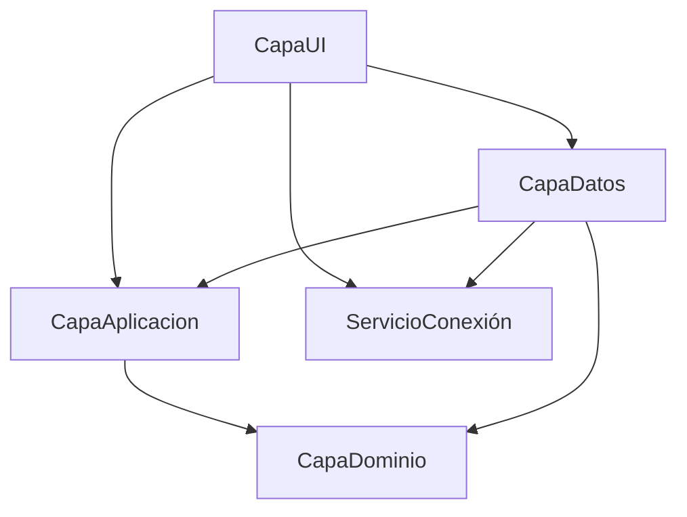

# Arquitectura Actual — Bimbo

> [!success] Actualizado 2026-09-11 — Rediseño del ícono de Pesajes y fix de `EmptyStateOverlay` (P-062)
> El ícono de balanza se centralizó como `IcoScale` (`PathGeometry`, `FillRule="Nonzero"`, `po:Freeze="True"`) en `Styles.xaml`, reemplazando el glifo de fuente del sidebar y las copias locales de `DashboardView`/`PesajeView`. De paso se encontró y cerró [[Deuda Técnica - Pendientes#P-062|P-062]]: `EmptyStateOverlay.OnIconoChanged` forzaba `Fill = Stroke` para cualquier ícono asignado, no solo los de relleno sólido — nueva propiedad `IconoEsRelleno` (default `false`) lo hace opcional y protege por default a todos los íconos de línea del proyecto. Ver [[Sesión 2026-09-11 - Rediseño e integración del icono de Pesajes]].

> [!success] Actualizado 2026-09-11 — "Recordar mi usuario" en el login, 100% local
> Checkbox opcional (destildado por default) que guarda solo el correo — nunca la contraseña — en `%APPDATA%\BimboPesaje\Preferencias\ultimo_usuario.txt`, aislado por máquina y sin tocar Supabase. Nuevo contrato `IPreferenciasInicioSesionService` (`CapaAplicacion4`) implementado en `CapaDatos.Preferencias`. Ver [[Sesión 2026-09-11 - Recordar mi usuario en Login]].

> [!success] Actualizado 2026-09-11 — `ChangeTracker<T>` erradica el dirty tracking manual en los 5 modales de catálogo
> `ChangeTracker<T>` (`CapaUI/Core/Validacion/`), genérico y sellado, reemplazó las cadenas de `!string.Equals` en `ProveedorModal`, `ProductoModal`, `FabricanteModal`, `CategoriaModal` y `PresentacionModal` por comparación de valor sobre un `record` privado por modal. De paso se cerró la auditoría externa de las optimizaciones WPF de Antigravity contra las investigaciones de QA: `EnumToBooleanConverter` quedó `sealed` con comparación bit a bit, y el swap atómico de `CancellationTokenSource` dejó de llamar `Dispose()` sobre el token reemplazado (P-060), evitando el riesgo de `ObjectDisposedException` documentado en la investigación de concurrencia. Ver [[Auditoría Externa — Optimizaciones WPF de Antigravity vs. Investigaciones QA]] y [[Sesión 2026-09-11 - Dirty Tracking tipado con ChangeTracker y optimizaciones finales]].

> [!success] Actualizado 2026-09-10 — Solución migrada a .NET 10 (LTS)
> Se completó la migración de los proyectos de la solución (`CapaUI`, `CapaAplicacion`, `CapaDatos`, `CapaDominio`, `BimboProyecto.Tests` y `ServicioConexión`) a target framework `net10.0-windows` y `net10.0` con suite de tests limpia (344/344). Esto previene la obsolescencia técnica ante el fin de soporte de .NET 8 en noviembre de 2026.

> [!info] Plan de distribución registrado 2026-09-08 — no implementado
> Se acordó mantener el código privado y distribuir instalador/paquetes mediante un repositorio público separado, con actualizaciones descargadas dentro de WPF. La primera instalación será por máquina en Windows 11 x64 y conservará la arquitectura online. Velopack, CI/CD, firma, canales y barrera de cierre siguen pendientes de implementación y de las autorizaciones indicadas en [[Plan de CI-CD y Actualizaciones Remotas]] y [[ADR-027 - Codigo privado y distribucion publica de actualizaciones]]. Esta anotación no cambia el estado ejecutable del sistema.

> [!success] Actualizado 2026-09-03 — Presentaciones migrado a RPC segura
> Presentaciones deja de ser el único catálogo con creación por función `SECURITY INVOKER` y con `UPDATE`/baja lógica por DML directo. Ahora usa `crear_presentacion_seguro`, `actualizar_presentacion_seguro` y `cambiar_estado_presentacion_seguro` (idempotentes, RBAC por código `PRESENTACIONES_*`, auditoría y notificación en una transacción). Se retiró el trigger `trg_upd_presentacion` y se revocó el DML directo sobre `presentacion_producto` a `authenticated`/`anon`. BD + capa de datos aplicadas y verificadas (243/243 tests); `PresentacionModal` y el `DROP` de la función legacy quedan pendientes de build/prueba. Ver [[Sesión 2026-09-03 - Presentaciones migrado a RPC segura]] y [[Plan de Migración de Presentaciones a RPC segura]].

> [!success] Actualizado 2026-09-03 — Notificaciones visuales y archivo masivo atómico
> La campana, la bandeja completa y el diálogo de detalle comparten recursos WPF, distinguen severidad de lectura y exponen acciones inequívocas; la corrección visual fue aprobada el 2026-09-03. `Marcar todas como leídas y archivar` conserva al usuario en Bandeja y ejecuta un único `UPDATE` autorizado sobre todas sus filas no archivadas, seguido de una recarga RPC de listado y contador. Ver [[Módulo Notificaciones]] y [[Sesión 2026-09-03 - Corrección visual y acción masiva de Notificaciones]].

> [!success] Actualizado 2026-09-02 — Administrador inmutable con acceso total
> La ruta Roles administra el catálogo de roles y sus permisos mediante RPC transaccionales con autorización y bitácora. El rol Administrador se identifica mediante `roles.es_sistema`: su nombre, estado y permisos son inmutables, conserva las 34 acciones actuales y recibe automáticamente toda acción futura. Ver [[Módulo Usuarios]] y [[ADR-024 - Rol Administrador inmutable con acceso total]].

> [!info] Propuesta arquitectónica — Caché L1 en memoria e invalidación reactiva por Realtime
> Se encuentra en evaluación la transición del modelo de catálogos (*stale-while-revalidate* de [[ADR-015 - Cache de catalogos mostrar y revalidar]]) hacia una caché unificada L1 en memoria administrada mediante `ZiggyCreatures.FusionCache` e invalidación reactiva basada en eventos de `supabase_realtime`. Esta propuesta elimina las consultas de fondo redundantes por apertura de selector modal, erradica el riesgo de fuga de datos entre sesiones en una misma terminal ([[Deuda Técnica - Pendientes#P-048]]), y descarta formalmente el uso de almacenamiento L2 en clientes de planta. Ver [[ADR-026 - Cache en memoria con FusionCache e invalidacion por Realtime]].

> [!success] Actualizado 2026-08-17 — Módulo Reportería operativo
> Reportería ofrece cuatro consultas: entrada de materia prima, resumen por proveedor, productos con merma y primeros 10 productos activos. Las consultas pasan por RPC protegidas con `Consultar Reporte`; la exportación PDF/Excel registra primero la operación auditada y solo después escribe el archivo. Ver [[Módulo Reportería]].

> [!info] MOC del proyecto
> Este nodo describe el estado actual de la arquitectura. Para el contexto completo de Claude Code, ver [[CLAUDE]].

> [!success] Actualizado 2026-08-15 — Usuarios protegido contra autoadministración
> La cuenta de la sesión no puede cambiar su propio rol ni estado. UI y repositorio comparan `IdUsuario`; Supabase protege `id_rol`/`id_estado` con `auth.uid()`, permisos por campo y una política UPDATE limitada a `authenticated`. `ActualizarUltimoAccesoAsync` continúa permitido. Ver [[ADR-020 - Defensa en profundidad contra autoadministracion de usuarios]].

> [!success] Actualizado 2026-08-14 — Configuración de empresa y tema dinámico global
> El engranaje abre un modal protegido por `Modificar Configuración` para editar la fila singleton de `empresa`, reemplazar el logo y aplicar el color corporativo al login, shell, vistas y modales. La escritura usa `IEmpresaRepository`/`EmpresaRepository`, Storage `empresa-logos` y RLS alineado con el permiso de la aplicación. El cliente no escribe `updated_at`; ese campo queda reservado a la automatización de base de datos. Ver [[Módulo Configuración de Empresa]] y [[ADR-019 - Configuración de empresa y tema dinámico global]].

> [!success] Actualizado 2026-09-02 — RBAC auditable y detalle integrado de roles
> El menú, las acciones CRUD, la navegación y las aperturas de modal validan el permiso vigente mediante `SesionPermisos`. El contrato usa `acciones.codigo_accion` como identificador global y estable; los nombres quedan como etiquetas editables. `RolesView` presenta una cuadrícula y abre por `IdRol` un detalle con `acciones_roles` agrupadas por módulo, sin repetir consultas. Las mutaciones usan RPC auditadas e idempotentes y el Administrador es inmutable. Ver [[Módulo Usuarios]], [[ADR-024 - Rol Administrador inmutable con acceso total]] y [[Sesión 2026-09-02 - Permisos integrados en el detalle del rol]].

> [!success] Actualizado 2026-07-23 — Sesión y permisos refactorizados (commit `f105047`, Emanuel)
> **`SesionActual` y `servicioSesionActual` (holders estáticos en `CapaDominio`) eliminados.** Reemplazados por `IUsuarioSesionService` (Singleton en DI) + entidad `UsuarioSesion`. Fuente única de verdad de autenticación y permisos.
> **Permisos ahora reales desde BD** (`acciones_roles`/`acciones`/`modulos`) — antes `SesionPermisos` tenía un `switch(idRol)` hardcodeado. `SesionPermisos` es ahora una fachada estática que delega en `IUsuarioSesionService`.
> **Módulo Usuarios** implementado con el patrón de Productos (View/VM/Modal/Repos). Revisión QA y deuda en [[Sesión 2026-07-23 - Revisión QA Módulo Usuarios y Refactor de Sesión (Emanuel)]].

> [!success] Actualizado 2026-06-21
> **BimboPesaje eliminado.** La app es ahora un proyecto WPF puro (CapaUI). Ya no existe la capa híbrida WinForms + WPF embebido.
> **CapaServicios disuelto.** Sus 4 clases (`SesionActual`, `servicioSesionActual`, `PesoCalculator`, `ServicioBuscador`) vivían ya en namespace `CapaDominio` — se movieron físicamente al proyecto `CapaDominio` y se eliminó la referencia de `CapaUI`.
> **Módulos Proveedores, Fabricantes y Categorías** implementados con el mismo patrón que Productos.
> **`SuggestionSearchBox` compartido.** UserControl en `CapaUI/Core/Controls/` centraliza popup, teclado y lógica de sugerencias. Código duplicado eliminado. 5 bugs de UX corregidos. 7 formularios lo usan (Productos, Proveedores, Fabricantes, Categorías, Contactos Fabricantes, Contactos Proveedores, Usuarios — este último corregido 2026-07-26, tenía un `TextBox` plano en su lugar).
> **Módulos Contactos Fabricantes y Contactos Proveedores** implementados con patrón drill-down (2026-06-21). Ver [[Módulo Contactos (Drill-down)]].
> **Soporte DPI Per-Monitor V2 y multi-resolución** (2026-06-21): `app.manifest` + props de rendering en todas las vistas/modales + modales con scroll. Ver [[WPF - DPI Awareness y Escalado Multi-Resolución]].

---

## Ejecutable único

**`CapaUI`** es el único ejecutable de la solución.
- Entry point: `CapaUI/App.xaml` → `App.OnStartup`
- Login: `LoginWindow` (WPF)
- Shell principal: `MainWindow` (WPF)

---

## Diagrama de dependencias



> [!warning] Regla
> `CapaAplicacion` **nunca** referencia `CapaDatos`. La flecha va en sentido contrario.

---

## Proyectos en la solución

| Proyecto | Rol | TargetFramework | Ejecutable |
|---|---|---|---|
| `CapaUI` | Vistas WPF + ViewModels | `net10.0-windows` | ✅ Único ejecutable |
| `CapaAplicacion` | Interfaces, DTOs, estrategias de búsqueda | `net10.0` | No |
| `CapaDatos` | Implementaciones Supabase, repositorios | `net10.0` | No |
| `CapaDominio` | Entidades de dominio, sesión, cálculos, estado | `net10.0` | No |
| `BimboProyecto.Tests` | Pruebas unitarias de la solución | `net10.0` | No |
| `ServicioConexión` | Singleton cliente Supabase (huérfano en P-056) | `net10.0-windows` | No |

**Eliminados 2026-05-29:**
- ~~`BimboPesaje`~~ — proyecto WinForms host, eliminado (C13/C14)
- ~~`CapaServicios`~~ — sus 4 clases absorbidas por `CapaDominio`; referencia eliminada de la solución
- ~~`GestorRealtime.cs`~~ — gestor Realtime obsoleto, eliminado
- ~~`GestorNotificaciones.cs`~~ — dependía de GestorRealtime, eliminado
- ~~`ServicioLogo.cs`~~ — solo usado por BimboPesaje, eliminado

---

## Las dos rutas del módulo Productos

### Ruta A — Buscador Universal

```
UniversalSearchViewModel
    ↓ MediatR
UniversalSearchHandler
    ↓ SearchStrategyRegistry
ProductoSearchStrategy
    ↓ IRepository<Producto>
ProductoSearchRepository → Supabase
    ↓
Producto (entidad de dominio)
```

### Ruta B — Formulario de Productos

```
ProductosViewModel
    ↓ IProductoRepository
ProductoCrudRepository → Supabase
    ↓
ProductoDto (DTO de aplicación)
```

---

## Realtime — arquitectura vigente

La bandeja interna usa Supabase como única fuente de verdad. Se suscribe primero a `notificaciones_usuario` filtrando por el usuario interno y después consulta por RPC la lista activa, las cinco recientes del desplegable y el contador de no leídas. Realtime solo avisa que debe refrescarse el estado; al reconectar se recrea el canal y se vuelven a consultar las RPC. Las mutaciones individuales y masivas también terminan con esa recarga autorizada, sin modificar colecciones locales de forma optimista. Sin conexión, la bandeja se declara no disponible y no simula operaciones confirmadas. Ver [[Módulo Notificaciones]] y [[ADR-025 - Notificaciones internas con Supabase como fuente de verdad]].

```
RealtimeService (Singleton en DI)
    ├─ SuscribirAsync / Desuscribir
    └─ Observar() → IDisposable token

RealtimeAwareViewModel (base class)
    └─ Observar(tabla, handler) → auto-unsubscribe en Dispose()

ProductosViewModel : RealtimeAwareViewModel
```

- `GestorRealtime` y `GestorNotificaciones` **eliminados** — todos los formularios WinForms que los usaban también fueron eliminados con BimboPesaje.

---

## Patrones implementados

| Patrón | Dónde | Estado |
|---|---|---|
| [[Clean Architecture]] | Todas las capas | ✅ Implementado |
| [[Repository Pattern]] | CapaDatos/Repositories | ✅ Dos variantes |
| [[Strategy Pattern]] | CapaAplicacion/Search | ✅ Implementado |
| [[CQRS + Mediator]] | Buscador universal | ✅ Con MediatR |
| [[Observer Pattern]] | ViewModels (ObservableObject) | ✅ CommunityToolkit |
| [[Result Pattern]] | Repositorios nuevos | ✅ Implementado |
| [[Base Repository con TryAsync]] | CapaDatos/Repositories | ✅ Implementado |
| [[Interceptar Cierre de Ventana]] | MainWindow (CapaUI) | ✅ Implementado |
| [[Recuperacion de Contrasenia con Supabase OTP\|Recuperación de Contraseña OTP]] | ForgotCodePanel (CapaUI) | ✅ Implementado |
| RealtimeAwareViewModel | CapaUI/Core/MVVM | ✅ Implementado |
| Lazy DI init (App.Services) | CapaUI/App.xaml.cs | ✅ C13 — 2026-05-29 |
| SuggestionSearchBox (UserControl compartido) | CapaUI/Core/Controls/ | ✅ 2026-05-29 |
| Drill-down navigation (panel toggle) | ContactosFabricantesView, ContactosProveedoresView | ✅ 2026-06-21 |
| DPI Per-Monitor V2 + escalado multi-resolución | app.manifest + rendering en todas las vistas/modales | ✅ 2026-06-21 |
| [[Detector-de-Conexion\|Detector/Monitor de Conexión]] | `IConexionMonitor`, semáforo online/degradado/offline | ✅ 2026-05-30 |
| `SpanningGridPanel` (grilla de columnas con span) | CapaUI/Core/Controls/ — usado hoy solo por Roles | ✅ 2026-08-11 |
| [[Columna de Numero de Fila en DataGrid\|Columna # (número de fila) en DataGrid]] | `NumeroFilaConverter` + `PlantillaCeldaNumeroFila` en `Styles.xaml`; primera columna en las 10 tablas de lista | ✅ 2026-09-03 |

---

## Módulos

| Módulo | Estado | Archivos clave |
|---|---|---|
| [[Módulo Productos]] | ✅ Completo | ProductosView, ProductosViewModel, ProductoCrudRepository |
| [[Módulos de Catálogos Administrativos\|Proveedores]] | ✅ Completo | ProveedoresView, ProveedoresViewModel, ProveedorCrudRepository — creación auditada por RPC |
| [[Módulos de Catálogos Administrativos\|Fabricantes]] | ✅ Completo | FabricantesView, FabricantesViewModel, FabricanteCrudRepository — creación auditada por RPC |
| [[Módulos de Catálogos Administrativos\|Categorías]] | ✅ Completo | CategoriasView, CategoriasViewModel, CategoriaCrudRepository — creación auditada por RPC |
| [[Módulos de Catálogos Administrativos\|Presentaciones]] | ✅ Completo — CRUD por RPC segura `_seguro` (2026-09-03), UI pendiente de prueba | PresentacionesView, PresentacionesViewModel, PresentacionCrudRepository — creación auditada por RPC |
| [[Módulo Contactos (Drill-down)\|Contactos Fabricantes]] | ✅ Completo | ContactosFabricantesView, ContactosFabricantesViewModel, ContactoFabricanteCrudRepository |
| [[Módulo Contactos (Drill-down)\|Contactos Proveedores]] | ✅ Completo | ContactosProveedoresView, ContactosProveedoresViewModel, ContactoProveedorCrudRepository |
| [[Buscador Universal Bimbo]] | ✅ Completo | Multi-entidad con Strategy + Mediator |
| [[Módulo Usuarios]] | ✅ Completo (RBAC auditable y detalle de roles 2026-09-02) | UsuariosView, RolesView, RolModal, UsuarioRepository, RolRepository, RolPermisoRepository, UsuarioSesionService — CRUD + auth + permisos desde BD y Administración inmutable |
| [[Módulo Notificaciones]] | 🟢 Operativo (corrección visual aprobada 2026-09-03) | Campana con cinco recientes, bandeja paginada, diálogo XAML, severidad visual, lectura/archivo individual y masivo atómico, emisores idempotentes, RPC/RLS/Realtime y navegación autorizada |
| [[Módulo Empleados]] | ✅ Completo (2026-07-26) | EmpleadosView, EmpleadosViewModel, EmpleadoCrudRepository — CRUD completo, crea usuario desde empleado |
| [[Módulo Bitácora]] | ✅ Completo + reportes PDF/Excel (2026-08-16) | BitacoraView, BitacoraViewModel, BitacoraCrudRepository — consulta de auditoría, selección múltiple y reporte registrado por RPC antes de entregar archivo |
| [[Módulo Reportería]] | ✅ Cuatro reportes operativos PDF/Excel (2026-08-17) | ReporteriaView, ReporteriaViewModel, ReporteConsultaRepository, cuatro RPC de consulta — vista previa paginada y exportación auditada |
| [[Módulo Pesaje]] | ✅ Flujo rediseñado; RPC auditadas parcialmente integradas y probadas (2026-08-24) | PesajeView, PesajeViewModel, PesajeRepository — `movimientos` e ingreso de pesajes usan RPC idempotentes con RBAC y bitácora; las demás escrituras siguen pendientes de migración — ⚠️ datos de tara de prueba (P-023) y validación visual de estados descriptivos (P-046) |
| [[Módulo Configuración de Empresa]] | ✅ Implementado; validación visual manual pendiente (2026-08-15) | ConfiguracionEmpresaModal, ConfiguracionEmpresaViewModel, EmpresaRepository, EmpresaThemeService, LogoEmpresaCache, IconoSidebarCache |

### Navegación entre módulos

Cada módulo sigue el patrón: **Route key → VM marker → DataTemplate**

```
Routes.Xxx (const string)
    ↓ MainViewModel._routes dict
XxxVM (clase marcador vacía : ViewModelBase)
    ↓ DataTemplate en MainWindow.xaml
XxxView (UserControl)
```

Para agregar una pantalla nueva:
1. Crear `UserControl` + `ViewModel` en `CapaUI/Formularios/Principal/Pantallas/Xxx/`
2. Agregar constante `Routes.Xxx` y entrada en `_routes` en `MainViewModel.cs`
3. Agregar `DataTemplate` en `MainWindow.xaml`
4. Registrar en DI en `App.xaml.cs`

---

## Advertencias conocidas

_Ninguna advertencia activa._ W-001 (CS0067 `SalirSolicitado`) eliminada — evento muerto removido de `ProductosView.xaml.cs`.

---

## Próximos pasos recomendados

1. **Replicar módulo Productos** para Empleados / Movimientos — usar [[Checklist - Replicar Módulo con Realtime]]
2. **Caché en memoria** para fabricantes/países (no cambian entre sesiones) — propuesta formal en [[ADR-026 - Cache en memoria con FusionCache e invalidacion por Realtime]]
3. **Result Pattern** consistente en todos los repositorios restantes
4. **Contactos Empleados** — si aplica, usar [[Módulo Contactos (Drill-down)]] como plantilla

---

## Relaciones

- [[Plan de CI-CD y Actualizaciones Remotas]] — diseño de entrega; implementación no iniciada
- [[ADR-027 - Codigo privado y distribucion publica de actualizaciones]] — decisión de distribución aceptada
- [[Sesión 2026-09-08 - Plan de CI-CD y actualizaciones remotas]] — registro exclusivamente documental
- [[Sesión 2026-09-03 - Corrección visual y acción masiva de Notificaciones]] — rediseño aprobado y cambio atómico de estado
- [[Módulo Notificaciones]] — campana, bandeja, detalle y persistencia de notificaciones internas
- [[ADR-026 - Cache en memoria con FusionCache e invalidacion por Realtime]] — propuesta arquitectónica de caché L1 e invalidación reactiva
- [[ADR-015 - Cache de catalogos mostrar y revalidar]] — arquitectura vigente de caché de catálogos
- [[Deuda Técnica - Pendientes]] — registro de deuda técnica del proyecto
- [[Conocimiento Principal]] — índice maestro de la base de conocimiento
- [[Módulo Productos]] — catálogo principal
- [[Gestor Realtime - Diseño Arquitectónico]] — infraestructura de WebSockets y eventos reactivos
