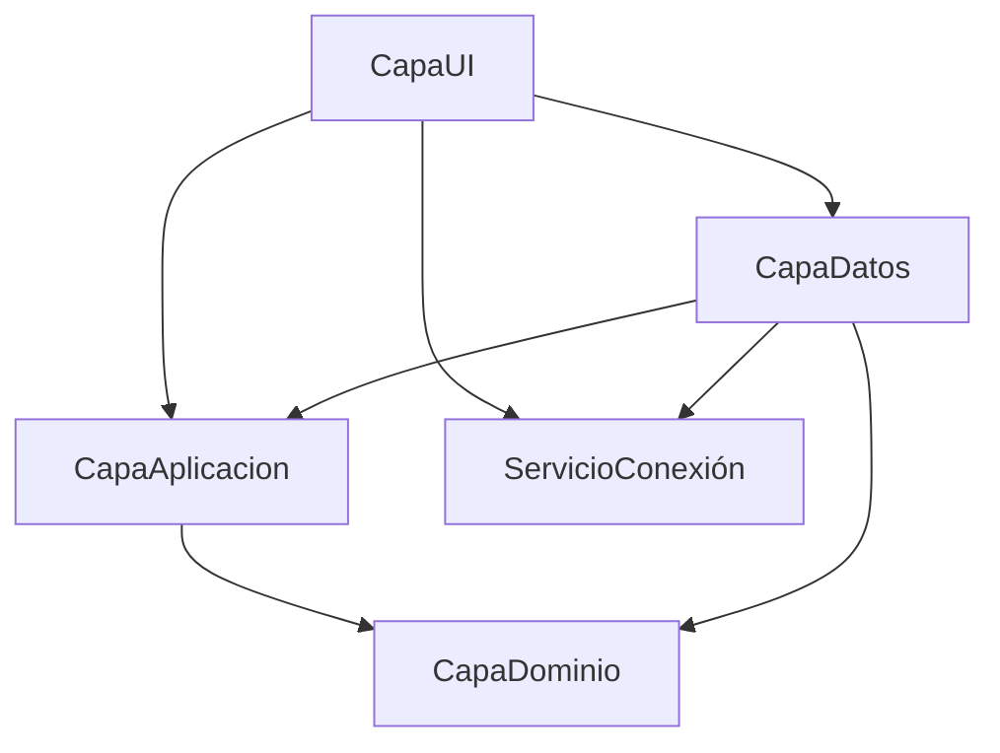

# Arquitectura Actual — Bimbo

> [!info] MOC del proyecto
> Este nodo describe el estado actual de la arquitectura. Para el contexto completo de Claude Code, ver [[CLAUDE]].

> [!success] Actualizado 2026-07-28 — Módulo Presentaciones de Producto (CRUD)
> **Nuevo módulo Presentaciones** implementado con el mismo patrón que Proveedores (`id_estado` integer, no bool como Categorías). RPC `contar_presentaciones` agregado en Supabase (migración `contar_presentaciones_rpc`). Botón en el submenú de Productos, debajo de Categorías.
> **Fix: alta forzada a Activo.** El modal permitía crear un registro directamente como Inactivo (radio Estado editable en modo Nuevo), lo que causaba que pareciera "no guardar" porque el filtro por defecto de la lista es Habilitados. Ahora en modo Nuevo el radio queda fijo en Activo y deshabilitado; el toggle a Inactivo solo aplica al editar (baja lógica). Ver [[Deuda Técnica - Pendientes]] si este mismo patrón aparece en otros módulos.
> **Enter-para-guardar.** En `PresentacionModal`, presionar Enter con el foco en el último campo de texto (Descripción) dispara el guardado, igual que el botón Guardar.

> [!success] Actualizado 2026-07-23 — Sesión y permisos refactorizados (commit `f105047`, Emanuel)
> **`SesionActual` y `servicioSesionActual` (holders estáticos en `CapaDominio`) eliminados.** Reemplazados por `IUsuarioSesionService` (Singleton en DI) + entidad `UsuarioSesion`. Fuente única de verdad de autenticación y permisos.
> **Permisos ahora reales desde BD** (`acciones_roles`/`acciones`/`modulos`) — antes `SesionPermisos` tenía un `switch(idRol)` hardcodeado. `SesionPermisos` es ahora una fachada estática que delega en `IUsuarioSesionService`.
> **Módulo Usuarios** implementado con el patrón de Productos (View/VM/Modal/Repos). Revisión QA y deuda en [[Sesión 2026-07-23 - Revisión QA Módulo Usuarios y Refactor de Sesión (Emanuel)]].

> [!success] Actualizado 2026-06-21
> **BimboPesaje eliminado.** La app es ahora un proyecto WPF puro (CapaUI). Ya no existe la capa híbrida WinForms + WPF embebido.
> **CapaServicios disuelto.** Sus 4 clases (`SesionActual`, `servicioSesionActual`, `PesoCalculator`, `ServicioBuscador`) vivían ya en namespace `CapaDominio` — se movieron físicamente al proyecto `CapaDominio` y se eliminó la referencia de `CapaUI`.
> **Módulos Proveedores, Fabricantes y Categorías** implementados con el mismo patrón que Productos.
> **`SuggestionSearchBox` compartido.** UserControl en `CapaUI/Core/Controls/` centraliza popup, teclado y lógica de sugerencias. Código duplicado eliminado. 5 bugs de UX corregidos. 8 formularios lo usan (Productos, Proveedores, Fabricantes, Categorías, Presentaciones — agregado 2026-07-28, Contactos Fabricantes, Contactos Proveedores, Usuarios — este último corregido 2026-07-26, tenía un `TextBox` plano en su lugar).
> **Módulos Contactos Fabricantes y Contactos Proveedores** implementados con patrón drill-down (2026-06-21). Ver [[Módulo Contactos (Drill-down)]].
> **Soporte DPI Per-Monitor V2 y multi-resolución** (2026-06-21): `app.manifest` + props de rendering en todas las vistas/modales + modales con scroll. Ver [[WPF - DPI Awareness y Escalado Multi-Resolución]].

---

## Ejecutable único

**`CapaUI`** es el único ejecutable de la solución.
- Entry point: `CapaUI/App.xaml` → `App.OnStartup`
- Login: `LoginWindow` (WPF)
- Shell principal: `MainWindow` (WPF)

---

## Diagrama de dependencias



> [!warning] Regla
> `CapaAplicacion` **nunca** referencia `CapaDatos`. La flecha va en sentido contrario.

---

## Proyectos en la solución

| Proyecto | Rol | Ejecutable |
|---|---|---|
| `CapaUI` | Vistas WPF + ViewModels | ✅ Único ejecutable |
| `CapaAplicacion` | Interfaces, DTOs, estrategias de búsqueda | No |
| `CapaDatos` | Implementaciones Supabase, repositorios | No |
| `CapaDominio` | Entidades de dominio, sesión, cálculos, estado | No |
| `ServicioConexión` | Singleton del cliente Supabase | No |

**Eliminados 2026-05-29:**
- ~~`BimboPesaje`~~ — proyecto WinForms host, eliminado (C13/C14)
- ~~`CapaServicios`~~ — sus 4 clases absorbidas por `CapaDominio`; referencia eliminada de la solución
- ~~`GestorRealtime.cs`~~ — gestor Realtime obsoleto, eliminado
- ~~`GestorNotificaciones.cs`~~ — dependía de GestorRealtime, eliminado
- ~~`ServicioLogo.cs`~~ — solo usado por BimboPesaje, eliminado

---

## Las dos rutas del módulo Productos

### Ruta A — Buscador Universal

```
UniversalSearchViewModel
    ↓ MediatR
UniversalSearchHandler
    ↓ SearchStrategyRegistry
ProductoSearchStrategy
    ↓ IRepository<Producto>
ProductoSearchRepository → Supabase
    ↓
Producto (entidad de dominio)
```

### Ruta B — Formulario de Productos

```
ProductosViewModel
    ↓ IProductoRepository
ProductoCrudRepository → Supabase
    ↓
ProductoDto (DTO de aplicación)
```

---

## Realtime — arquitectura vigente

```
RealtimeService (Singleton en DI)
    ├─ SuscribirAsync / Desuscribir
    └─ Observar() → IDisposable token

RealtimeAwareViewModel (base class)
    └─ Observar(tabla, handler) → auto-unsubscribe en Dispose()

ProductosViewModel : RealtimeAwareViewModel
```

- `GestorRealtime` y `GestorNotificaciones` **eliminados** — todos los formularios WinForms que los usaban también fueron eliminados con BimboPesaje.

---

## Patrones implementados

| Patrón | Dónde | Estado |
|---|---|---|
| [[Clean Architecture]] | Todas las capas | ✅ Implementado |
| [[Repository Pattern]] | CapaDatos/Repositories | ✅ Dos variantes |
| [[Strategy Pattern]] | CapaAplicacion/Search | ✅ Implementado |
| [[CQRS + Mediator]] | Buscador universal | ✅ Con MediatR |
| [[Observer Pattern]] | ViewModels (ObservableObject) | ✅ CommunityToolkit |
| [[Result Pattern]] | Repositorios nuevos | ✅ Implementado |
| [[Base Repository con TryAsync]] | CapaDatos/Repositories | ✅ Implementado |
| [[Interceptar Cierre de Ventana]] | MainWindow (CapaUI) | ✅ Implementado |
| [[Recuperacion de Contrasenia con Supabase OTP\|Recuperación de Contraseña OTP]] | ForgotCodePanel (CapaUI) | ✅ Implementado |
| RealtimeAwareViewModel | CapaUI/Core/MVVM | ✅ Implementado |
| Lazy DI init (App.Services) | CapaUI/App.xaml.cs | ✅ C13 — 2026-05-29 |
| SuggestionSearchBox (UserControl compartido) | CapaUI/Core/Controls/ | ✅ 2026-05-29 |
| Drill-down navigation (panel toggle) | ContactosFabricantesView, ContactosProveedoresView | ✅ 2026-06-21 |
| DPI Per-Monitor V2 + escalado multi-resolución | app.manifest + rendering en todas las vistas/modales | ✅ 2026-06-21 |
| [[Detector-de-Conexion\|Detector/Monitor de Conexión]] | `IConexionMonitor`, semáforo online/degradado/offline | ✅ 2026-05-30 |

---

## Módulos

| Módulo | Estado | Archivos clave |
|---|---|---|
| [[Módulo Productos]] | ✅ Completo | ProductosView, ProductosViewModel, ProductoCrudRepository |
| Proveedores | ✅ Completo | ProveedoresView, ProveedoresViewModel, ProveedorCrudRepository |
| Fabricantes | ✅ Completo | FabricantesView, FabricantesViewModel, FabricanteCrudRepository |
| Categorías | ✅ Completo | CategoriasView, CategoriasViewModel, CategoriaCrudRepository |
| Presentaciones | ✅ Completo (2026-07-28) | PresentacionesView, PresentacionesViewModel, PresentacionCrudRepository — `id_estado` integer (patrón Proveedores, no Categorías) |
| [[Módulo Contactos (Drill-down)\|Contactos Fabricantes]] | ✅ Completo | ContactosFabricantesView, ContactosFabricantesViewModel, ContactoFabricanteCrudRepository |
| [[Módulo Contactos (Drill-down)\|Contactos Proveedores]] | ✅ Completo | ContactosProveedoresView, ContactosProveedoresViewModel, ContactoProveedorCrudRepository |
| [[Buscador Universal Bimbo]] | ✅ Completo | Multi-entidad con Strategy + Mediator |
| [[Módulo Usuarios]] | ✅ Completo (2026-07-23, refactor 2026-07-26) | UsuariosView, UsuariosViewModel, UsuarioRepository, UsuarioSesionService — CRUD + auth + permisos desde BD |
| [[Módulo Empleados]] | ✅ Completo (2026-07-26) | EmpleadosView, EmpleadosViewModel, EmpleadoCrudRepository — CRUD completo, crea usuario desde empleado |
| [[Módulo Bitácora]] | ✅ Completo (2026-07-26) | BitacoraView, BitacoraViewModel, BitacoraCrudRepository — solo lectura **por diseño** (auditoría), filtros usuario/módulo/acción/fecha |
| [[Módulo Pesaje]] | ✅ Flujo rediseñado (2026-07-26) | PesajeView, PesajeViewModel, PesajeRepository, ProcesoDescargaModal (wizard + megamodal), SelectorProductosModal — ⚠️ datos de tara de prueba (P-023) |

### Navegación entre módulos

Cada módulo sigue el patrón: **Route key → VM marker → DataTemplate**

```
Routes.Xxx (const string)
    ↓ MainViewModel._routes dict
XxxVM (clase marcador vacía : ViewModelBase)
    ↓ DataTemplate en MainWindow.xaml
XxxView (UserControl)
```

Para agregar una pantalla nueva:
1. Crear `UserControl` + `ViewModel` en `CapaUI/Formularios/Principal/Pantallas/Xxx/`
2. Agregar constante `Routes.Xxx` y entrada en `_routes` en `MainViewModel.cs`
3. Agregar `DataTemplate` en `MainWindow.xaml`
4. Registrar en DI en `App.xaml.cs`

---

## Advertencias conocidas

_Ninguna advertencia activa._ W-001 (CS0067 `SalirSolicitado`) eliminada — evento muerto removido de `ProductosView.xaml.cs`.

---

## Próximos pasos recomendados

1. **Replicar módulo Productos** para Empleados / Movimientos — usar [[Checklist - Replicar Módulo con Realtime]]
2. **Caché en memoria** para fabricantes/países (no cambian entre sesiones)
3. **Result Pattern** consistente en todos los repositorios restantes
4. **Contactos Empleados** — si aplica, usar [[Módulo Contactos (Drill-down)]] como plantilla
