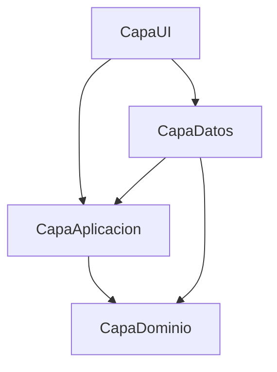

# Arquitectura Actual — Bimbo

> [!success] Actualizado 2026-09-21 — Configuración valida el código RBAC estable antes de guardar
> `EmpresaRepository` dejó de comparar la etiqueta visible `Modificar Configuración` contra la sesión, que almacena códigos de acción, y ahora exige `CONFIGURACION_MODIFICAR`. La autorización sigue siendo doble: validación local con `IUsuarioSesionService` y RLS de Supabase para `public.empresa` y `storage.objects`. Una prueba de regresión fija este contrato. Ver [[Sesión 2026-09-21 - Corrección RBAC al guardar Configuración de empresa]].

> [!success] Actualizado 2026-09-20 — «Mi Usuario» deja de ser un placeholder y trae el control de escala
> `Routes.MiUsuario` pasó de `ConstructionVM` a `MiUsuarioViewModel`, con `MiUsuarioView` en `Formularios/Principal/Pantallas/MiUsuario/`. Tres secciones: **Perfil** (solo lectura), **Apariencia** (escala de la app) y **Seguridad** (placeholder que dice dónde se cambia la contraseña hoy). Los botones `−`/`+` mueven la escala en pasos de 5 % entre 70 % y 130 %, **aplican al instante** y persisten con un `Debouncer` de 600 ms — sin eso, ir de 1,0 a 0,75 serían cinco escrituras a Supabase. Por eso `IEscalaService` quedó partido en `Aplicar(factor)` (solo visual) y `GuardarAsync(factor)` (persiste), y dejó de pedir una `Window` salvo en `AplicarA`, que llama cada ventana al nacer. **No usa `ChangeTracker` ni botón Guardar**, a diferencia de `ConfiguracionEmpresaView`: no hay nada pendiente de confirmar cuando cada cambio ya está aplicado; ese molde vuelve con la primera preferencia que no se aplique en vivo. La pantalla sugiere un factor según el DPI de Windows, avisa y se bloquea si `UI_ESCALA` está imponiendo uno, y «Restablecer» **borra** la fila de esa pantalla en vez de guardar 1,0, para que vuelva a heredar el ámbito `global`. Sin entrada en `_routePermissions`: RLS ya garantiza que cada quien edita lo suyo. Quedó [[Deuda Técnica - Pendientes#P-066|P-066]] por `ConstructionVM`, ahora huérfano. **Pantalla nueva: pendiente de prueba visual y aprobación de Fernando** — hasta entonces esto describe lo construido, no lo validado. Ver [[Sesión 2026-09-20 - Preferencias por usuario (Fase 1 del escalado)]].

> [!success] Actualizado 2026-09-20 — Popups y ToolTips siguen el escalado propio de la app
> `Popup`, `ToolTip` y los desplegables de `ComboBox` viven en ventanas Win32 propias y **no** heredan el `LayoutTransform` del escalado. Ahora lo toman por `{DynamicResource EscalaApp}` sobre un `ScaleTransform` en su `LayoutTransform`: un setter en la plantilla de `ModalCombo` cubre los **21 `ComboBox`**, un estilo **implícito** `TargetType="ToolTip"` cubre los **76 `ToolTip`**, y los 4 popups ad-hoc lo declaran explícito. La clave `EscalaApp` se declara con valor 1 en `App.xaml` y `DesignTimeResources.xaml`, **nunca en `Styles.xaml`** — mismo motivo que los colores `Empresa*`: el diccionario que cada control mergea localmente le ganaría al valor que `EscalaService` escribe en `Application.Resources`, y los popups quedarían en 1.0 sin error. Dos desfases con criterios opuestos: el `HorizontalOffset` del popup de notificaciones **escala** (distancia de diseño), el `VerticalOffset` de los tooltips **no** (compensa el cursor físico de 32 px). Verificado sobre el XAML real con un arné que abre un `ComboBox` y lee el transform, incluido el seguimiento en vivo. Ver [[Sesión 2026-09-20 - Preferencias por usuario (Fase 1 del escalado)]] y [[WPF - Escalar Popups y ToolTips que no heredan el LayoutTransform]].

> [!success] Actualizado 2026-09-20 — `RolModal` deja de ser ventana y pasa a modal sobre overlay
> Era la única ventana que el escalado propio rompía: `470×285` con `ResizeMode="NoResize"`, y el `LayoutTransform` escala el contenido pero no el marco, así que a 1,1× el contenido no entraba. Ahora es un `UserControl` sobre el overlay de `RolesView` con `ModalLayout.LimitarAlOverlay`, como los otros 14 modales — hereda el transform y avisa por `Cerrado`/`Guardado` en vez de `DialogResult`. Ya no queda ninguna excepción al patrón de modales salvo `NotificacionDetalleWindow`, que es ventana por diseño. Arné de instanciación en verde (470×285, idéntico a antes). Ver [[Sesión 2026-09-20 - Preferencias por usuario (Fase 1 del escalado)]].

> [!success] Actualizado 2026-09-20 — Escalado propio de la app: base, repositorio y servicio (Fases 1 a 3)
> Nueva tabla `public.usuario_preferencias`: clave/valor `jsonb` con PK `(id_usuario, clave, ambito)`, así que sumar una preferencia no necesita migración. `ambito` es `'global'` salvo para `escala_ui`, que guarda una por **huella de pantalla** (`1920x1080@1.75`). Es la única escritura del sistema que **no** pasa por RPC con auditoría: es dato del propio usuario y RLS lo acota. Lleva guardas propias por escribirse directo desde el cliente — formato de `clave`/`ambito`, tope de 4 KB por valor, máximo 100 filas por usuario, y `with check` en el `UPDATE` para que una fila no se reasigne a otro usuario. Al verificar el ACL apareció que Supabase concede `ALL` por defecto y que **RLS no filtra `TRUNCATE`**: corregido acá y abierto [[Deuda Técnica - Pendientes#P-065|P-065]] para las otras 19 tablas.
> Del lado del código quedó el cableado completo hasta la capa de datos: `IPreferenciasUsuarioRepository` en `CapaAplicacion4/Preferencias/`, modelo y repositorio en `CapaDatos` (**primer `.Upsert(` directo a tabla del proyecto**, el resto escribe por RPC), y `ValorPreferencia` / `ClavesPreferencia.HuellaPantalla` concentrando el formateo — porque con la cultura en español un `0.8` se escribiría `0,8` y el `CHECK` lo rechaza. 35 pruebas en 4 culturas.
> Y arriba de eso, `CapaUI/Services/Escala/EscalaService.cs` (`Scoped`, muere con el scope de sesión): aplica un `ScaleTransform` en el `LayoutTransform` del contenido de cada ventana, conmuta `TextFormattingMode` a `Ideal` fuera del factor neutro (`Display` cuantiza a píxeles enteros y un zoom desalinea esa cuantización), y **reescala las medidas fijas de la ventana** desde su valor declarado — el transform escala el contenido, no el marco. Arranca desde caché local sin red (`CargarCacheSinRed` antes de construir `MainWindow`) y reconcilia contra Supabase en `OnLoaded`, sin reaplicar sobre la ventana abierta. La política (rango 0,70–1,30, paso 0,05, factor sugerido por DPI) vive en `CapaAplicacion4/Preferencias/EscalaUi.cs`, sin WPF, para poder probarla. `WM_GETMINMAXINFO` **no se tocó**: ya lee `MinWidth`, que ahora llega escalado. Suite 676/676. Sin UI todavía: el factor se cambia por código. Ver [[Sesión 2026-09-20 - Preferencias por usuario (Fase 1 del escalado)]] e [[Inventario — Superficie de escalado propio (LayoutTransform global)]].

> [!success] Actualizado 2026-09-19 — Tooltips ya no quedan tapados por el cursor
> Todos los ToolTip de la app salen 17 px más abajo de lo que WPF pone por defecto, así la mano de 32 px no pisa el texto. `CapaUI/Core/ToolTipPlacement.cs` sobreescribe el valor por defecto de `ToolTipService.VerticalOffset` para `FrameworkElement` y se invoca una vez en `App.OnStartup`. Es un valor fijo: usar el tamaño de cursor de Windows dejaba el tooltip demasiado lejos. Ver [[Sesión 2026-09-19 - Tooltips tapados por el cursor]].

> [!success] Actualizado 2026-09-19 — Fila TOTAL de Entradas sin recorte al scrollear y layout de Movimiento
> En Pesaje, la fila TOTAL de Entradas dejó de perder NETO, BULTOS y el conteo de pesajes al achicar la ventana: se desplazaba con un `TranslateTransform` y el *layout clip* de WPF (que viaja con la transformación) recortaba lo que quedaba más allá del ancho visible. Ahora vive en un `ScrollViewer` oculto (`TotalScroll`) que copia el offset horizontal de la grilla. Además, los paneles Movimiento de Materia Prima y Camiones ocupan todo el alto disponible, y los encabezados de Pesajes se alinean a la izquierda. Ver [[Sesión 2026-09-19 - Layout de Movimiento de Materia Prima y sincronización de fila TOTAL en Pesajes]].

> [!success] Actualizado 2026-09-18 — «Recordar usuario» cifrado con DPAPI
> El correo de «Recordar usuario», que también es el usuario de login, se guarda cifrado con DPAPI (`ProtectedData`, `CurrentUser`, con entropía propia) en `%LOCALAPPDATA%\BimboPesaje\Preferencias\ultimo_usuario.bin`. Deja de estar en texto plano y en Roaming. El `.txt` viejo se migra y se borra solo. 7 tests nuevos. Cierra el punto 4.2 de [[Plan de Seguridad - Roadmap 10-10]]. Ver [[Sesión 2026-09-18 - Recordar usuario cifrado con DPAPI]].

> [!success] Actualizado 2026-09-18 — Camiones de Pesaje en tabla plana y reglas de recepción en BD
> «Camiones de Entrega» dejó de agrupar por placa: es un `DataGrid` donde **una fila es una recepción** (placa + proveedor), cada una con su KG manifestado. Tope de **5 recepciones abiertas contadas por fila**; la placa se repite solo con otro proveedor. Las reglas viven en `ReglasCamion.ValidarRecepciones` (12 tests) **y** en la BD: trigger `trg_validar_recepcion_movimiento` con advisory lock y el índice único `ux_movimientos_abierto_placa_proveedor`, que cubren todos los caminos de alta y edición. El reporte se elige por placa y junta todas sus recepciones en un solo archivo. Se eliminaron `GrupoCamionPesaje`, `CamionModal` y los N updates sin transacción. Ver [[ADR-029 - Recepciones de pesaje planas con reglas en trigger de tabla]] y [[Sesión 2026-09-18 - Camiones en tabla plana y reglas de recepción en BD]].

> [!success] Actualizado 2026-09-18 — Panel de control y gráfico de pesadas en PesajeModal
> `PesajeModal` suma un panel lateral en vivo: diferencia, tarjetas de acumulados (tara plana por pesada), barra de avance, gráfico `PesadasChart` (`OnRender`, sin librerías) con el punto "Ahora" y avisos en cascada. Las cuentas quedan en `CapaDominio/Reglas/ReglasPanelPesaje.cs` con 14 tests. La escala del eje Y es el doble del promedio, así la línea siempre queda a media altura. En `ConfiguracionEmpresaView` se corrigieron los títulos cruzados logo/ícono y el aviso del dominio pasó a mostrarse solo con foco. Revisado visualmente por Fernando. Ver [[Módulo Pesaje]] y [[Sesión 2026-09-18 - Panel de control y gráfico de pesadas en PesajeModal]].

> [!success] Actualizado 2026-09-18 — Auditoría legible y parámetros de reportes en texto
> Los campos visibles de Bitácora se normalizan a texto descriptivo en Supabase y cuentan con compatibilidad de lectura en C# para filas históricas estructuradas. `reporteria.parametros_reporte` y la RPC `ingresar_reporte_tabla_bitacora` usan ahora texto de extremo a extremo; Pesaje, Bitácora y Reportería construyen pares etiqueta–valor legibles. La migración remota, el catálogo, la prueba transaccional, el build y 560 pruebas quedaron verificados; la revisión visual autenticada sigue pendiente. Ver [[Módulo Bitácora]], [[Módulo Reportería]], [[Módulo Pesaje]] y [[Sesión 2026-09-18 - Auditoría legible y parámetros de reportes en texto]].

> [!success] Actualizado 2026-09-17 — Rediseño visual de Configuración de empresa
> `ConfiguracionEmpresaView` pasó a dos tarjetas hermanas de igual altura ("Información de la empresa" / "Identidad visual"), cada una con encabezado de ícono, título en color de empresa, subtítulo y línea inferior. Los rótulos van en mayúsculas y los inputs de 44px tienen placeholder. Las vistas previas son grandes con borde punteado y las 5 muestras de color son anchas, con aro en la activa (nuevo `TextosIgualesConverter`). La barra de acciones es una tarjeta aparte con el Guardar verde plano. Se mantuvo la decisión de no tener botón Cancelar. Se abrió [[Deuda Técnica - Pendientes#P-064|P-064]] (posible `Padding` duplicado en plantillas de `TextBox` compartidas). Ver [[Módulo Configuración de Empresa]] y [[Sesión 2026-09-17 - Rediseño visual de Configuración de empresa]].

> [!success] Actualizado 2026-09-17 — Filtros independientes en el Dashboard
> El selector del encabezado controla exclusivamente los KPI de pesajes y los RadioButtons controlan exclusivamente el Top 5 de mermas. Ambos conservan su selección en refrescos, reconexiones y eventos Realtime mediante estados y cancelaciones independientes. La opción interna `Mes` ahora representa una ventana móvil de 30 días, comparada con los 30 días inmediatamente anteriores. El inventario permanece como corte actual y el feed de últimos pesajes continúa global. Cambio validado visualmente por Fernando, con build limpio, 526 pruebas y arnés WPF aprobado. Ver [[Módulo Dashboard]] y [[Sesión 2026-09-17 - Filtros independientes en Dashboard]].

> [!success] Actualizado 2026-09-17 — Integración de datos en vivo del Dashboard con FusionCache y Realtime
> Se conectó la vista existente del Dashboard (`DashboardView.xaml`) a datos reales en vivo desde Supabase, eliminando el 100% de los datos mock de `DashboardVM.cs`. La arquitectura implementa el Approach A: repositorio dedicado `DashboardRepository` con caché L1 `FusionCache` (5 min, etiquetada con `TagsCache.CatalogosRaiz`) exclusivamente para conteos de catálogos, política zero-cache para pesajes/mermas (conforme a [[ADR-026 - Cache en memoria con FusionCache e invalidacion por Realtime]]), RPC PostgreSQL `consultar_kpis_pesajes` optimizada en una pasada con `FILTER (WHERE ...)` y suscripción reactiva Realtime para el feed de pesajes recientes. Ver [[Módulo Dashboard]] y [[Sesión 2026-09-17 - Integración de datos en vivo del Dashboard con FusionCache y Realtime]].

> [!success] Actualizado 2026-09-16 — Reorganización de cuadrícula y campos de auditoría estilo Pesajes en ProductoModal
> Se reubicó País importado a la fila 2 y Estado a la fila 3 de `ProductoModal.xaml`, eliminando el hueco libre y logrando simetría total de 3 columnas por fila. Los campos de auditoría Creado y Actualizado se estandarizaron globalmente en `Styles.xaml` (`ModalInputAuditoria`) adoptando el diseño display de Pesajes: fondo traslúcido `#1AFFFFFF`, barrita verde de acento `#34D399`, tipografía menta `#6EE7B7`, cursor flecha y sin foco, erradicando la falsa impresión de control congelado. Ver [[Sesión 2026-09-16 - Reorganización de cuadrícula y campos de auditoría estilo Pesajes en ProductoModal]].

> [!success] Actualizado 2026-09-11 — Rediseño del ícono de Pesajes y fix de `EmptyStateOverlay` (P-062)
> El ícono de balanza se centralizó como `IcoScale` (`PathGeometry`, `FillRule="Nonzero"`, `po:Freeze="True"`) en `Styles.xaml`, reemplazando el glifo de fuente del sidebar y las copias locales de `DashboardView`/`PesajeView`. De paso se encontró y cerró [[Deuda Técnica - Pendientes#P-062|P-062]]: `EmptyStateOverlay.OnIconoChanged` forzaba `Fill = Stroke` para cualquier ícono asignado, no solo los de relleno sólido — nueva propiedad `IconoEsRelleno` (default `false`) lo hace opcional y protege por default a todos los íconos de línea del proyecto. Ver [[Sesión 2026-09-11 - Rediseño e integración del icono de Pesajes]].

> [!success] Actualizado 2026-09-11 — "Recordar mi usuario" en el login, 100% local
> Checkbox opcional (destildado por default) que guarda solo el correo — nunca la contraseña — en `%APPDATA%\BimboPesaje\Preferencias\ultimo_usuario.txt`, aislado por máquina y sin tocar Supabase. *(Desde 2026-09-18: cifrado con DPAPI en `%LOCALAPPDATA%` — ver arriba.)* Nuevo contrato `IPreferenciasInicioSesionService` (`CapaAplicacion4`) implementado en `CapaDatos.Preferencias`. Ver [[Sesión 2026-09-11 - Recordar mi usuario en Login]].

> [!success] Actualizado 2026-09-11 — `ChangeTracker<T>` erradica el dirty tracking manual en los 5 modales de catálogo
> `ChangeTracker<T>` (`CapaUI/Core/Validacion/`), genérico y sellado, reemplazó las cadenas de `!string.Equals` en `ProveedorModal`, `ProductoModal`, `FabricanteModal`, `CategoriaModal` y `PresentacionModal` por comparación de valor sobre un `record` privado por modal. De paso se cerró la auditoría externa de las optimizaciones WPF de Antigravity contra las investigaciones de QA: `EnumToBooleanConverter` quedó `sealed` con comparación bit a bit, y el swap atómico de `CancellationTokenSource` dejó de llamar `Dispose()` sobre el token reemplazado (P-060), evitando el riesgo de `ObjectDisposedException` documentado en la investigación de concurrencia. Ver [[Auditoría Externa — Optimizaciones WPF de Antigravity vs. Investigaciones QA]] y [[Sesión 2026-09-11 - Dirty Tracking tipado con ChangeTracker y optimizaciones finales]].

> [!success] Actualizado 2026-09-10 — Solución migrada a .NET 10 (LTS)
> Se completó la migración de los proyectos de la solución (`CapaUI`, `CapaAplicacion`, `CapaDatos`, `CapaDominio`, `BimboProyecto.Tests` y `ServicioConexión`) a target framework `net10.0-windows` y `net10.0` con suite de tests limpia (344/344). Esto previene la obsolescencia técnica ante el fin de soporte de .NET 8 en noviembre de 2026.

> [!info] Plan de distribución registrado 2026-09-08 — no implementado
> Se acordó mantener el código privado y distribuir instalador/paquetes mediante un repositorio público separado, con actualizaciones descargadas dentro de WPF. La primera instalación será por máquina en Windows 11 x64 y conservará la arquitectura online. Velopack, CI/CD, firma, canales y barrera de cierre siguen pendientes de implementación y de las autorizaciones indicadas en [[Plan de CI-CD y Actualizaciones Remotas]] y [[ADR-027 - Codigo privado y distribucion publica de actualizaciones]]. Esta anotación no cambia el estado ejecutable del sistema.

> [!success] Actualizado 2026-09-03 — Presentaciones migrado a RPC segura
> Presentaciones deja de ser el único catálogo con creación por función `SECURITY INVOKER` y con `UPDATE`/baja lógica por DML directo. Ahora usa `crear_presentacion_seguro`, `actualizar_presentacion_seguro` y `cambiar_estado_presentacion_seguro` (idempotentes, RBAC por código `PRESENTACIONES_*`, auditoría y notificación en una transacción). Se retiró el trigger `trg_upd_presentacion` y se revocó el DML directo sobre `presentacion_producto` a `authenticated`/`anon`. BD + capa de datos aplicadas y verificadas (243/243 tests); `PresentacionModal` y el `DROP` de la función legacy quedan pendientes de build/prueba. Ver [[Sesión 2026-09-03 - Presentaciones migrado a RPC segura]] y [[Plan de Migración de Presentaciones a RPC segura]].

> [!success] Actualizado 2026-09-03 — Notificaciones visuales y archivo masivo atómico
> La campana, la bandeja completa y el diálogo de detalle comparten recursos WPF, distinguen severidad de lectura y exponen acciones inequívocas; la corrección visual fue aprobada el 2026-09-03. `Marcar todas como leídas y archivar` conserva al usuario en Bandeja y ejecuta un único `UPDATE` autorizado sobre todas sus filas no archivadas, seguido de una recarga RPC de listado y contador. Ver [[Módulo Notificaciones]] y [[Sesión 2026-09-03 - Corrección visual y acción masiva de Notificaciones]].

> [!success] Actualizado 2026-09-02 — Administrador inmutable con acceso total
> La ruta Roles administra el catálogo de roles y sus permisos mediante RPC transaccionales con autorización y bitácora. El rol Administrador se identifica mediante `roles.es_sistema`: su nombre, estado y permisos son inmutables, conserva las 34 acciones actuales y recibe automáticamente toda acción futura. Ver [[Módulo Usuarios]] y [[ADR-024 - Rol Administrador inmutable con acceso total]].

> [!info] Propuesta arquitectónica — Caché L1 en memoria e invalidación reactiva por Realtime
> Se encuentra en evaluación la transición del modelo de catálogos (*stale-while-revalidate* de [[ADR-015 - Cache de catalogos mostrar y revalidar]]) hacia una caché unificada L1 en memoria administrada mediante `ZiggyCreatures.FusionCache` e invalidación reactiva basada en eventos de `supabase_realtime`. Esta propuesta elimina las consultas de fondo redundantes por apertura de selector modal, erradica el riesgo de fuga de datos entre sesiones en una misma terminal ([[Deuda Técnica - Pendientes#P-048]]), y descarta formalmente el uso de almacenamiento L2 en clientes de planta. Ver [[ADR-026 - Cache en memoria con FusionCache e invalidacion por Realtime]].

> [!success] Actualizado 2026-08-17 — Módulo Reportería operativo
> Reportería ofrece cuatro consultas: entrada de materia prima, resumen por proveedor, productos con merma y primeros 10 productos activos. Las consultas pasan por RPC protegidas con `Consultar Reporte`; la exportación PDF/Excel registra primero la operación auditada y solo después escribe el archivo. Ver [[Módulo Reportería]].

> [!info] MOC del proyecto
> Este nodo describe el estado actual de la arquitectura. Para el contexto completo de Claude Code, ver [[CLAUDE]].

> [!success] Actualizado 2026-08-15 — Usuarios protegido contra autoadministración
> La cuenta de la sesión no puede cambiar su propio rol ni estado. UI y repositorio comparan `IdUsuario`; Supabase protege `id_rol`/`id_estado` con `auth.uid()`, permisos por campo y una política UPDATE limitada a `authenticated`. `ActualizarUltimoAccesoAsync` continúa permitido. Ver [[ADR-020 - Defensa en profundidad contra autoadministracion de usuarios]].

> [!success] Actualizado 2026-08-14 — Configuración de empresa y tema dinámico global
> El engranaje abre un modal protegido por `Modificar Configuración` para editar la fila singleton de `empresa`, reemplazar el logo y aplicar el color corporativo al login, shell, vistas y modales. La escritura usa `IEmpresaRepository`/`EmpresaRepository`, Storage `empresa-logos` y RLS alineado con el permiso de la aplicación. El cliente no escribe `updated_at`; ese campo queda reservado a la automatización de base de datos. Ver [[Módulo Configuración de Empresa]] y [[ADR-019 - Configuración de empresa y tema dinámico global]].

> [!success] Actualizado 2026-09-02 — RBAC auditable y detalle integrado de roles
> El menú, las acciones CRUD, la navegación y las aperturas de modal validan el permiso vigente mediante `SesionPermisos`. El contrato usa `acciones.codigo_accion` como identificador global y estable; los nombres quedan como etiquetas editables. `RolesView` presenta una cuadrícula y abre por `IdRol` un detalle con `acciones_roles` agrupadas por módulo, sin repetir consultas. Las mutaciones usan RPC auditadas e idempotentes y el Administrador es inmutable. Ver [[Módulo Usuarios]], [[ADR-024 - Rol Administrador inmutable con acceso total]] y [[Sesión 2026-09-02 - Permisos integrados en el detalle del rol]].

> [!success] Actualizado 2026-07-23 — Sesión y permisos refactorizados (commit `f105047`, Emanuel)
> **`SesionActual` y `servicioSesionActual` (holders estáticos en `CapaDominio`) eliminados.** Reemplazados por `IUsuarioSesionService` (Singleton en DI) + entidad `UsuarioSesion`. Fuente única de verdad de autenticación y permisos.
> **Permisos ahora reales desde BD** (`acciones_roles`/`acciones`/`modulos`) — antes `SesionPermisos` tenía un `switch(idRol)` hardcodeado. `SesionPermisos` es ahora una fachada estática que delega en `IUsuarioSesionService`.
> **Módulo Usuarios** implementado con el patrón de Productos (View/VM/Modal/Repos). Revisión QA y deuda en [[Sesión 2026-07-23 - Revisión QA Módulo Usuarios y Refactor de Sesión (Emanuel)]].

> [!success] Actualizado 2026-06-21
> **BimboPesaje eliminado.** La app es ahora un proyecto WPF puro (CapaUI). Ya no existe la capa híbrida WinForms + WPF embebido.
> **CapaServicios disuelto.** Sus 4 clases (`SesionActual`, `servicioSesionActual`, `PesoCalculator`, `ServicioBuscador`) vivían ya en namespace `CapaDominio` — se movieron físicamente al proyecto `CapaDominio` y se eliminó la referencia de `CapaUI`.
> **Módulos Proveedores, Fabricantes y Categorías** implementados con el mismo patrón que Productos.
> **`SuggestionSearchBox` compartido.** UserControl en `CapaUI/Core/Controls/` centraliza popup, teclado y lógica de sugerencias. Código duplicado eliminado. 5 bugs de UX corregidos. 7 formularios lo usan (Productos, Proveedores, Fabricantes, Categorías, Contactos Fabricantes, Contactos Proveedores, Usuarios — este último corregido 2026-07-26, tenía un `TextBox` plano en su lugar).
> **Módulos Contactos Fabricantes y Contactos Proveedores** implementados con patrón drill-down (2026-06-21). Ver [[Módulo Contactos (Drill-down)]].
> **Soporte DPI Per-Monitor V2 y multi-resolución** (2026-06-21): `app.manifest` + props de rendering en todas las vistas/modales + modales con scroll. Ver [[WPF - DPI Awareness y Escalado Multi-Resolución]].

---

## Ejecutable único

**`CapaUI`** es el único ejecutable de la solución.
- Entry point: `CapaUI/App.xaml` → `App.OnStartup`
- Login: `LoginWindow` (WPF)
- Shell principal: `MainWindow` (WPF)

---

## Diagrama de dependencias



> [!info] Conexión a Supabase
> El singleton `ConexionSupabase` vive en `CapaDatos/Conexion.cs` (namespace `ServicioConexión.Conexion`, conservado para no romper los `using`). Hasta el 2026-09-10 existía además un proyecto `ServicioConexión` huérfano con una copia duplicada — ver P-056.

> [!warning] Regla
> `CapaAplicacion` **nunca** referencia `CapaDatos`. La flecha va en sentido contrario.

---

## Proyectos en la solución

| Proyecto | Rol | TargetFramework | Ejecutable |
|---|---|---|---|
| `CapaUI` | Vistas WPF + ViewModels | `net10.0-windows` | ✅ Único ejecutable |
| `CapaAplicacion` | Interfaces, DTOs, estrategias de búsqueda | `net10.0` | No |
| `CapaDatos` | Implementaciones Supabase, repositorios | `net10.0` | No |
| `CapaDominio` | Entidades de dominio, sesión, cálculos, estado | `net10.0` | No |
| `BimboProyecto.Tests` | Pruebas unitarias de la solución | `net10.0` | No |

**Eliminado 2026-09-11 (traído de rama huérfana, fix del 2026-09-10):**
- ~~`ServicioConexión`~~ — proyecto huérfano que duplicaba `ConexionSupabase` con el mismo namespace; ningún `.csproj` lo referenciaba (P-056). Se borraron también `ServicioConexión.csproj` y `CapaConexión.csproj`. Ver [[Deuda Técnica - Pendientes#P-056]].

**Eliminados 2026-05-29:**
- ~~`BimboPesaje`~~ — proyecto WinForms host, eliminado (C13/C14)
- ~~`CapaServicios`~~ — sus 4 clases absorbidas por `CapaDominio`; referencia eliminada de la solución
- ~~`GestorRealtime.cs`~~ — gestor Realtime obsoleto, eliminado
- ~~`GestorNotificaciones.cs`~~ — dependía de GestorRealtime, eliminado
- ~~`ServicioLogo.cs`~~ — solo usado por BimboPesaje, eliminado

---

## Las dos rutas del módulo Productos

### Ruta A — Buscador Universal

```
UniversalSearchViewModel
    ↓ MediatR
UniversalSearchHandler
    ↓ SearchStrategyRegistry
ProductoSearchStrategy
    ↓ IRepository<Producto>
ProductoSearchRepository → Supabase
    ↓
Producto (entidad de dominio)
```

### Ruta B — Formulario de Productos

```
ProductosViewModel
    ↓ IProductoRepository
ProductoCrudRepository → Supabase
    ↓
ProductoDto (DTO de aplicación)
```

---

## Realtime — arquitectura vigente

La bandeja interna usa Supabase como única fuente de verdad. Se suscribe primero a `notificaciones_usuario` filtrando por el usuario interno y después consulta por RPC la lista activa, las cinco recientes del desplegable y el contador de no leídas. Realtime solo avisa que debe refrescarse el estado; al reconectar se recrea el canal y se vuelven a consultar las RPC. Las mutaciones individuales y masivas también terminan con esa recarga autorizada, sin modificar colecciones locales de forma optimista. Sin conexión, la bandeja se declara no disponible y no simula operaciones confirmadas. Ver [[Módulo Notificaciones]] y [[ADR-025 - Notificaciones internas con Supabase como fuente de verdad]].

```
RealtimeService (Singleton en DI)
    ├─ SuscribirAsync / Desuscribir
    └─ Observar() → IDisposable token

RealtimeAwareViewModel (base class)
    └─ Observar(tabla, handler) → auto-unsubscribe en Dispose()

ProductosViewModel : RealtimeAwareViewModel
```

- `GestorRealtime` y `GestorNotificaciones` **eliminados** — todos los formularios WinForms que los usaban también fueron eliminados con BimboPesaje.

---

## Patrones implementados

| Patrón | Dónde | Estado |
|---|---|---|
| [[Clean Architecture]] | Todas las capas | ✅ Implementado |
| [[Repository Pattern]] | CapaDatos/Repositories | ✅ Dos variantes |
| [[Strategy Pattern]] | CapaAplicacion/Search | ✅ Implementado |
| [[CQRS + Mediator]] | Buscador universal | ✅ Con MediatR |
| [[Observer Pattern]] | ViewModels (ObservableObject) | ✅ CommunityToolkit |
| [[Result Pattern]] | Repositorios nuevos | ✅ Implementado |
| [[Base Repository con TryAsync]] | CapaDatos/Repositories | ✅ Implementado |
| [[Interceptar Cierre de Ventana]] | MainWindow (CapaUI) | ✅ Implementado |
| [[Recuperacion de Contrasenia con Supabase OTP\|Recuperación de Contraseña OTP]] | ForgotCodePanel (CapaUI) | ✅ Implementado |
| RealtimeAwareViewModel | CapaUI/Core/MVVM | ✅ Implementado |
| Lazy DI init (App.Services) | CapaUI/App.xaml.cs | ✅ C13 — 2026-05-29 |
| SuggestionSearchBox (UserControl compartido) | CapaUI/Core/Controls/ | ✅ 2026-05-29 |
| Drill-down navigation (panel toggle) | ContactosFabricantesView, ContactosProveedoresView | ✅ 2026-06-21 |
| DPI Per-Monitor V2 + escalado multi-resolución | app.manifest + rendering en todas las vistas/modales | ✅ 2026-06-21 |
| [[Detector-de-Conexion\|Detector/Monitor de Conexión]] | `IConexionMonitor`, semáforo online/degradado/offline | ✅ 2026-05-30 |
| `SpanningGridPanel` (grilla de columnas con span) | CapaUI/Core/Controls/ — usado hoy solo por Roles | ✅ 2026-08-11 |
| [[Columna de Numero de Fila en DataGrid\|Columna # (número de fila) en DataGrid]] | `NumeroFilaConverter` + `PlantillaCeldaNumeroFila` en `Styles.xaml`; primera columna en las 10 tablas de lista | ✅ 2026-09-03 |

---

## Módulos

| Módulo                                                   | Estado                                                                            | Archivos clave                                                                                                                                                                                                                                                             |
| -------------------------------------------------------- | --------------------------------------------------------------------------------- | -------------------------------------------------------------------------------------------------------------------------------------------------------------------------------------------------------------------------------------------------------------------------- |
| [[Módulo Productos]]                                     | ✅ Completo                                                                        | ProductosView, ProductosViewModel, ProductoCrudRepository                                                                                                                                                                                                                  |
| [[Módulos de Catálogos Administrativos\|Proveedores]]    | ✅ Completo                                                                        | ProveedoresView, ProveedoresViewModel, ProveedorCrudRepository — creación auditada por RPC                                                                                                                                                                                 |
| [[Módulos de Catálogos Administrativos\|Fabricantes]]    | ✅ Completo                                                                        | FabricantesView, FabricantesViewModel, FabricanteCrudRepository — creación auditada por RPC                                                                                                                                                                                |
| [[Módulos de Catálogos Administrativos\|Categorías]]     | ✅ Completo                                                                        | CategoriasView, CategoriasViewModel, CategoriaCrudRepository — creación auditada por RPC                                                                                                                                                                                   |
| [[Módulos de Catálogos Administrativos\|Presentaciones]] | ✅ Completo — CRUD por RPC segura `_seguro` (2026-09-03), UI pendiente de prueba   | PresentacionesView, PresentacionesViewModel, PresentacionCrudRepository — creación auditada por RPC                                                                                                                                                                        |
| [[Módulo Contactos (Drill-down)\|Contactos Fabricantes]] | ✅ Completo                                                                        | ContactosFabricantesView, ContactosFabricantesViewModel, ContactoFabricanteCrudRepository                                                                                                                                                                                  |
| [[Módulo Contactos (Drill-down)\|Contactos Proveedores]] | ✅ Completo                                                                        | ContactosProveedoresView, ContactosProveedoresViewModel, ContactoProveedorCrudRepository                                                                                                                                                                                   |
| [[Buscador Universal Bimbo]]                             | ✅ Completo                                                                        | Multi-entidad con Strategy + Mediator                                                                                                                                                                                                                                      |
| [[Módulo Usuarios]]                                      | ✅ Completo (RBAC auditable y detalle de roles 2026-09-02)                         | UsuariosView, RolesView, RolModal, UsuarioRepository, RolRepository, RolPermisoRepository, UsuarioSesionService — CRUD + auth + permisos desde BD y Administración inmutable                                                                                               |
| [[Módulo Notificaciones]]                                | 🟢 Operativo (corrección visual aprobada 2026-09-03)                              | Campana con cinco recientes, bandeja paginada, diálogo XAML, severidad visual, lectura/archivo individual y masivo atómico, emisores idempotentes, RPC/RLS/Realtime y navegación autorizada                                                                                |
| [[Módulo Empleados]]                                     | ✅ Completo (2026-07-26)                                                           | EmpleadosView, EmpleadosViewModel, EmpleadoCrudRepository — CRUD completo, crea usuario desde empleado                                                                                                                                                                     |
| [[Módulo Bitácora]]                                      | ✅ Completo + reportes PDF/Excel (2026-08-16)                                      | BitacoraView, BitacoraViewModel, BitacoraCrudRepository — consulta de auditoría, selección múltiple y reporte registrado por RPC antes de entregar archivo                                                                                                                 |
| [[Módulo Reportería]]                                    | ✅ Cuatro reportes operativos PDF/Excel (2026-08-17)                               | ReporteriaView, ReporteriaViewModel, ReporteConsultaRepository, cuatro RPC de consulta — vista previa paginada y exportación auditada                                                                                                                                      |
| [[Módulo Pesaje]]                                        | ✅ Flujo rediseñado; RPC auditadas parcialmente integradas y probadas (2026-08-24) | PesajeView, PesajeViewModel, PesajeRepository — `movimientos` e ingreso de pesajes usan RPC idempotentes con RBAC y bitácora; las demás escrituras siguen pendientes de migración — ⚠️ datos de tara de prueba (P-023) y validación visual de estados descriptivos (P-046) |
| [[Módulo Configuración de Empresa]]                      | ✅ Implementado; validación visual manual pendiente (2026-08-15)                   | ConfiguracionEmpresaModal, ConfiguracionEmpresaViewModel, EmpresaRepository, EmpresaThemeService, LogoEmpresaCache, IconoSidebarCache                                                                                                                                      |

### Navegación entre módulos

Cada módulo sigue el patrón: **Route key → VM marker → DataTemplate**

```
Routes.Xxx (const string)
    ↓ MainViewModel._routes dict
XxxVM (clase marcador vacía : ViewModelBase)
    ↓ DataTemplate en MainWindow.xaml
XxxView (UserControl)
```

Para agregar una pantalla nueva:
1. Crear `UserControl` + `ViewModel` en `CapaUI/Formularios/Principal/Pantallas/Xxx/`
2. Agregar constante `Routes.Xxx` y entrada en `_routes` en `MainViewModel.cs`
3. Agregar `DataTemplate` en `MainWindow.xaml`
4. Registrar en DI en `App.xaml.cs`

---

## Advertencias conocidas

_Ninguna advertencia activa._ W-001 (CS0067 `SalirSolicitado`) eliminada — evento muerto removido de `ProductosView.xaml.cs`.

---

## Próximos pasos recomendados

1. **Replicar módulo Productos** para Empleados / Movimientos — usar [[Checklist - Replicar Módulo con Realtime]]
2. **Caché en memoria** para fabricantes/países (no cambian entre sesiones) — propuesta formal en [[ADR-026 - Cache en memoria con FusionCache e invalidacion por Realtime]]
3. **Result Pattern** consistente en todos los repositorios restantes
4. **Contactos Empleados** — si aplica, usar [[Módulo Contactos (Drill-down)]] como plantilla

---

## Relaciones

- [[Plan de CI-CD y Actualizaciones Remotas]] — diseño de entrega; implementación no iniciada
- [[ADR-029 - Recepciones de pesaje planas con reglas en trigger de tabla]] — una fila por recepción; cupo y unicidad en trigger de tabla
- [[ADR-027 - Codigo privado y distribucion publica de actualizaciones]] — decisión de distribución aceptada
- [[Sesión 2026-09-08 - Plan de CI-CD y actualizaciones remotas]] — registro exclusivamente documental
- [[Sesión 2026-09-03 - Corrección visual y acción masiva de Notificaciones]] — rediseño aprobado y cambio atómico de estado
- [[Módulo Notificaciones]] — campana, bandeja, detalle y persistencia de notificaciones internas
- [[ADR-026 - Cache en memoria con FusionCache e invalidacion por Realtime]] — propuesta arquitectónica de caché L1 e invalidación reactiva
- [[ADR-015 - Cache de catalogos mostrar y revalidar]] — arquitectura vigente de caché de catálogos
- [[Deuda Técnica - Pendientes]] — registro de deuda técnica del proyecto
- [[Conocimiento Principal]] — índice maestro de la base de conocimiento
- [[Módulo Productos]] — catálogo principal
- [[Gestor Realtime - Diseño Arquitectónico]] — infraestructura de WebSockets y eventos reactivos
