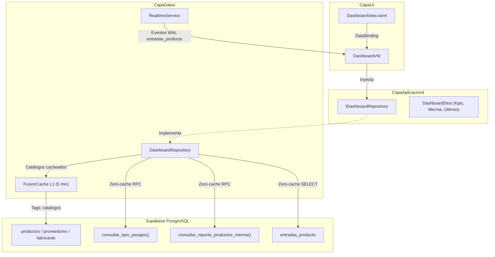

# Módulo Dashboard

## Propósito

El Dashboard (`DashboardView.xaml`, ubicado en la navegación bajo el grupo `Reportería`) ofrece una vista ejecutiva y operativa en tiempo real del estado de la planta y recepción de materia prima. Presenta indicadores clave de rendimiento (KPIs), comparativas respecto a períodos anteriores, un gráfico de mermas de productos críticos y un flujo en vivo de pesajes recientes.

---

## Estructura de la Vista (`DashboardView.xaml`)

1. **Encabezado Estándar de Módulo**:
   - Tarjeta / insignia visual de 38×38 px con esquinas redondeadas (8 px), sombra de elevación del color corporativo primario (`EmpresaPrimaryColor`) e icono vectorial blanco `IcoDashboard` (extraído de `D:\Proyectos\Iconos\Dashboard.svg`).
   - Miga de pan unificada (`Reportería / Dashboard`) y título de módulo (`Dashboard`).
   - Pastilla de fecha actual localizada en formato largo (`DateLabel`).
   - Selector de período (`Hoy`, `Semana`, `Últimos 30 días`) que filtra exclusivamente los KPI transaccionales de pesajes: **Total Pesajes**, **Total Neto** y **% Merma**.
   - Botón estandarizado "Actualizar" (`ActionBtn`) conectado a `RefreshCommand` para forzar la recarga inmediata.
   - Barra de progreso indeterminada y banner reactivo de errores integrados en la cabecera.
   - Fondo general homologado a `#EAF1F8` e inclusión de `Styles.xaml` como diccionario fusionado para diseñador de VS (ADR-028 / P-057).
2. **Fila 1 — KPIs de Inventario**:
   - **Productos**: Total de productos activos en catálogo.
   - **Proveedores**: Total de proveedores activos registrados.
   - **Marcas**: Total de fabricantes activos en el sistema.
   - Badges de variación respecto a períodos anteriores (muestran `"—"` si no hay histórico disponible).
3. **Fila 2 — KPIs de Pesajes del Período**:
   - **Total Pesajes**: Cantidad de entradas físicas registradas en balanza.
   - **Total Neto**: Suma acumulada de kilos netos recibidos.
   - **% Merma**: Porcentaje de merma global calculado sobre el peso teórico manifestado.
4. **Fila 3 — Gráfico de Productos con Más Merma**:
   - Top 5 productos con mayor porcentaje de merma dentro del período seleccionado.
   - Selector propio (`Hoy`, `Semana`, `Últimos 30 días`), independiente del selector de KPI del encabezado.
   - Barra de progreso con gradiente reactivo según umbrales de severidad:
     - Normal: `< 3%` (gradiente corporativo `EmpresaPrimaryGradientBrush`).
     - Alerta: `3% – 4%` (gradiente ámbar `#F59E0B`).
     - Crítico: `>= 4%` (gradiente rojo `#DC2626`).
5. **Fila 4 — Feed de Últimos Pesajes**:
   - Lista de las últimas 5 entradas registradas con código de pesaje, producto, hora y kilos netos.
   - El feed es global y no se filtra por ninguno de los dos selectores de período.
   - Indicador visual animado (`LivePulseDot`) y actualización instantánea vía WebSockets.

---

## Períodos y consultas independientes

El Dashboard mantiene dos selecciones tipadas y separadas en `DashboardVM`:

| Control | Estado y comando | Datos afectados |
|---|---|---|
| Selector desplegable del encabezado | `PeriodoKpis` / `SelectPeriodoKpisCommand` | Total Pesajes, Total Neto y % Merma |
| RadioButtons del Top 5 | `PeriodoMerma` / `SelectPeriodoMermaCommand` | Gráfico de productos con mayor merma |

- Cambiar un control no modifica ni vuelve a consultar la sección del otro.
- Inventario (Productos, Proveedores y Marcas) representa el corte actual del catálogo y no depende de períodos.
- Últimos pesajes conserva su consulta global de las cinco entradas más recientes.
- `PeriodoDashboard.Mes` se conserva como identificador interno compatible, pero su semántica vigente es una ventana móvil inclusiva de **30 días** (`hoy - 29` hasta `hoy`), mostrada como **Últimos 30 días**.
- Para los KPI, la comparación de esa ventana se realiza contra los 30 días inmediatamente anteriores. `Hoy` compara con ayer y `Semana` usa lunes a domingo contra la semana anterior.
- La actualización manual, la reconexión y un evento Realtime recargan cada sección con su propia selección vigente.
- Cada flujo posee su propio `CancellationTokenSource`; una selección rápida cancela únicamente la consulta anterior de esa misma sección y los resultados obsoletos se descartan antes de actualizar la UI.

---

## Flujo Técnico y Arquitectura

### 1. Capa de Aplicación (`CapaAplicacion4/Dashboard/`)
- **`IDashboardRepository`**: Expone `ObtenerKpisInventarioAsync`, `ObtenerKpisPesajesAsync`, `ObtenerTopMermaAsync` y `ObtenerUltimosPesajesAsync`.
- **`DashboardDtos`**: DTOs inmutables tipados (`KpisInventarioDto`, `KpisPesajesDto`, `MermaProductoDto`, `UltimoPesajeDto`, `PeriodoDashboard`).

### 2. Capa de Datos (`CapaDatos/Repositories/Dashboard/`)
- **`DashboardRepository`**: Hereda de `RepositorioBase` (telemetría con Stopwatch, verificación de red `IConexionMonitor`).
- **Cumplimiento de ADR-026**:
  - **Caché en Catálogos**: Los conteos de productos, proveedores y marcas usan `FusionCacheService` con TTL de 5 minutos y etiqueta `TagsCache.CatalogosRaiz`. Se invalidan inmediatamente mediante `InvalidadorCacheRealtime` al mutar cualquier catálogo.
  - **Zero-Cache**: Las consultas de pesajes, cálculo de mermas y entradas recientes **nunca** se almacenan en caché; siempre consultan el estado actual en la base de datos.

### 3. Base de Datos (`supabase/migrations/20260917132500_consultar_kpis_pesajes.sql`)
- Función RPC `consultar_kpis_pesajes`:
  - `SECURITY INVOKER` y `search_path = ''`.
  - Calcula en una única pasada agrupada por movimiento y con cláusulas `FILTER (WHERE ...)` las entradas válidas (`id_estado <> 9`) del período actual y del período anterior de comparación.

### 4. Tiempo Real y Ciclo de Vida en UI
- `DashboardVM` hereda de `RealtimeAwareViewModel`, gestionando la conexión reactiva a `entradas_producto`. Ante un cambio Realtime, vuelve a consultar los cinco pesajes más recientes y actualiza por separado los KPI y el Top 5 con sus períodos seleccionados; el inventario no se recarga por este evento.
- La animación `LivePulseDot` se inicializa en `Loaded` y se detiene y desvincula limpiamente en `Unloaded` en `DashboardView.xaml.cs` para evitar fugas de memoria y bloqueos de hilo de renderizado (conforme a P-031).

---

## Archivos clave

- `CapaUI/Formularios/Dashboard/DashboardView.xaml`
- `CapaUI/Formularios/Dashboard/DashboardVM.cs`
- `CapaAplicacion4/Dashboard/Interfaces/IDashboardRepository.cs`
- `CapaAplicacion4/Dashboard/Dtos/DashboardDtos.cs`
- `CapaDatos/Repositories/Dashboard/DashboardRepository.cs`
- `supabase/migrations/20260917132500_consultar_kpis_pesajes.sql`
- `BimboProyecto.Tests/Dashboard/DashboardUnitTests.cs`

---

## Relaciones

- [[Arquitectura Actual]]
- [[Módulo Reportería]]
- [[ADR-026 - Cache en memoria con FusionCache e invalidacion por Realtime]]
- [[Sesión 2026-09-17 - Integración de datos en vivo del Dashboard con FusionCache y Realtime]]
- [[Sesión 2026-09-17 - Filtros independientes en Dashboard]]
