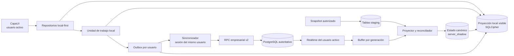
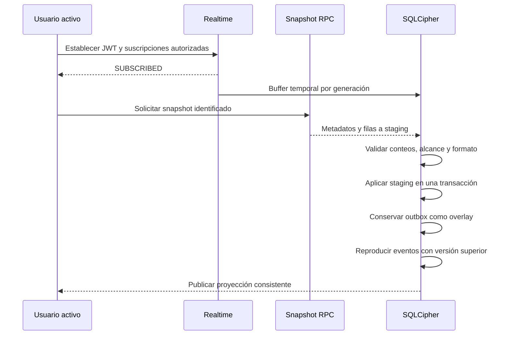

# Plan Offline-First de Pesaje

> [!warning] Estado documental
> Este documento describe una **arquitectura propuesta y todavía no aprobada para implementación**. No representa el estado ejecutable actual. No se han agregado paquetes, proyectos, migraciones, RPC, políticas, triggers ni cambios de Realtime como resultado de esta planificación.

> [!abstract] Objetivo
> Conservar Supabase/PostgreSQL como fuente autoritativa empresarial y convertir SQLCipher en la fuente local única de las pantallas compatibles con modo offline. La conectividad solamente determina si una operación local se sincroniza inmediatamente o permanece pendiente; nunca cambia el origen de datos de la interfaz durante una sesión.

## Registro de correcciones incorporadas

La revisión del 2026-08-30 reemplaza el diseño preliminar y fija estos requisitos:

- La idempotencia se resuelve antes de RBAC, versión y transición empresarial, después de validar mínimamente `auth.uid()`.
- Dos llamadas concurrentes con el mismo `id_solicitud` se serializan y no duplican modificación ni bitácora.
- Realtime se suscribe antes del snapshot; los eventos se almacenan temporalmente y se reproducen después de aplicar staging.
- Los snapshots son identificados, autorizados, acotados y verificables; no se descarga todo el historial como regla permanente.
- Una reducción de permisos elimina inmediatamente la visibilidad local y puede poner datos en cuarentena o purgarlos.
- La base compartida v1 contiene únicamente Pesaje y catálogos necesarios de la sucursal.
- Las cuentas Supabase continúan siendo individuales para dos operadores y un supervisor.
- La `outbox`, sesiones, conflictos y operaciones se aíslan por usuario y concesión offline.
- Un supervisor resuelve mediante una solicitud nueva; nunca se apropia de la solicitud original.
- `device_id` local es informativo salvo que exista registro y credencial central del dispositivo.
- La versión se incrementa por trigger en todos los caminos de escritura.
- Las RPC v2 tienen nombres únicos y específicos; no se usan sobrecargas ni una RPC genérica de estados.
- Una entidad puede participar en varias solicitudes mediante `outbox_entities`.
- Se separan bitácora exitosa, intentos rechazados y logs técnicos.
- Las migraciones locales son forward-only, con backup cifrado, rescate de outbox y copia fuera del disco.
- Los errores transitorios se reintentan sin descarte automático, con backoff, lease y una sola instancia del sincronizador.
- La versión actual verificada es SQLCipher 4.18.0, basada en SQLite 3.53.4.
- `cipher_integrity_check` se complementa con `quick_check` e `integrity_check`.
- Las capas superiores dependen de repositorios, unidad de trabajo y sincronización, no de SQLite directamente.

## Hechos confirmados

- `CapaUI` es el ejecutable WPF activo sobre .NET 8.
- `CapaUI` consume repositorios definidos en `CapaAplicacion4`; la lógica empresarial principal no está dispersa como llamadas directas a Supabase desde las vistas.
- `CapaDatos` implementa repositorios, Auth, Realtime y acceso a RPC.
- El flujo principal de Pesaje usa `movimientos`, `movimiento_productos` y `entradas_producto`.
- Existen diez RPC idempotentes y auditadas de Pesaje; su integración en C# todavía es parcial.
- Existe `private.solicitudes_rpc`, y `public.bitacora.id_solicitud` mantiene la relación uno-a-muchos.
- Ninguna de las once tablas candidatas a réplica tiene una columna `version`.
- El esquema real no contiene tabla ni columna de sucursal.
- La sesión de la aplicación es actualmente singleton y mantiene un solo usuario activo.
- Se prevén tres usuarios de aplicación en una computadora: dos operadores limitados a Pesaje y un supervisor.
- Cada persona conserva su propia cuenta Supabase; una cuenta compartida invalidaría la atribución de la bitácora.

## Contradicciones con la implementación actual

1. `private.preparar_solicitud_pesaje` valida usuario activo y permiso RBAC antes de reclamar `id_solicitud`. El diseño futuro debe resolver primero el replay idempotente después de validar mínimamente la identidad Supabase.
2. `private.solicitudes_rpc` solo admite `EN_PROCESO` y `COMPLETADA`; el diseño de rechazos terminales requiere ampliar el contrato en una migración futura.
3. El esquema no modela sucursales. No puede prometerse RLS, snapshot o concesión por sucursal hasta introducir ese alcance central.
4. Realtime hoy notifica a ViewModels que vuelven a consultar Supabase. En la arquitectura propuesta actualizará `server_shadow` en SQLCipher y la UI reaccionará a la proyección local.
5. Las tablas usan `updated_at`, pero no una versión explícita ni validación optimista.
6. Existen dos fuentes `ConexionSupabase`; deben consolidarse antes de agregar sincronización.
7. El asesor Supabase marca `private.solicitudes_rpc` por RLS deshabilitado, mientras que una inspección anterior mostró privilegios DML directos restringidos y el esquema `private` no expuesto normalmente. Antes de decidir se deberán revisar juntos Data API, `USAGE`, grants, propietarios y RLS; no se presume ni se corrige automáticamente la exposición.
8. La helper privada actual funciona como dispatcher de varias acciones de Pesaje. Las RPC v2 públicas serán específicas y no heredarán un selector genérico de estados.

## Decisiones confirmadas para el diseño

- Flujo local-first: la UI consulta siempre SQLCipher en pantallas offline-compatible.
- PostgreSQL/Supabase continúa siendo la fuente autoritativa.
- No se cambia de fuente de datos durante una sesión.
- La primera base SQLCipher compartida contiene solo Pesaje y catálogos necesarios para la sucursal.
- Las cuentas Supabase son individuales.
- El cambio de usuario offline usa un PIN local separado de la contraseña Supabase y una concesión firmada vigente.
- No se almacenan contraseñas.
- No se almacenan simultáneamente varios refresh tokens en v1.
- El supervisor no puede enviar ni apropiarse de la cola de un operador.
- Toda mutación central usa una RPC empresarial específica.
- `service_role` permanece fuera del cliente.
- Realtime es descendente y no durable.
- SQLCipher se compila y mantiene internamente.

## Decisiones pendientes y puertas de avance

| Decisión | Estado | Fase que bloquea |
|---|---|---|
| Modelo central de sucursales y asignación de usuarios, dispositivos y movimientos | Pendiente | Snapshot productivo y escrituras offline |
| Una cuenta Windows compartida o perfiles Windows separados | Pendiente | Diseño definitivo de clave/base local |
| Vigencia de la concesión offline; 12 horas es solo candidato | Pendiente | Autenticación offline |
| Número de equipos y equipos simultáneos por sucursal | Pendiente | Dimensionamiento de Realtime |
| PKI, firma y custodia corporativa para concesiones y escrow | Pendiente | Recuperación y dispositivo autoritativo |
| Medio físico distinto para respaldar outbox | Pendiente | Piloto productivo offline |
| Matriz exacta de operaciones permitidas offline | Pendiente | Habilitación de escrituras |
| Ventana de historial local autorizado | Pendiente | Contrato de snapshot |
| Credencial autoritativa de dispositivo: certificado, CNG/TPM u otra | Pendiente | Auditoría por equipo |
| Módulos futuros offline del supervisor | Pospuesta | Expansión posterior a v1 |

## Arquitectura objetivo



Separación conceptual:

- `server_shadow`: último estado canónico conocido.
- `outbox`: propuestas locales todavía no confirmadas.
- Proyección visible: estado canónico más overlays locales activos.
- Staging: snapshot descargado pero aún no visible.
- Grants locales: alcance que el usuario activo puede consultar.

## Componentes afectados

### Proyecto propuesto `CapaPersistenciaLocal`

Responsabilidad exclusiva sobre SQLCipher:

- `SqlCipherConnectionFactory`
- `SqlCipherBootstrapper`
- `SqlCipherRuntimeVerifier`
- `LocalMigrationRunner`
- `EncryptedBackupService`
- `OutboxRecoveryExporter`
- `SnapshotStagingStore`
- `ServerShadowStore`
- `LocalProjectionStore`
- `LocalScopeGrantStore`
- `OfflineGrantStore`
- `DeviceCredentialStore`
- `OutboxStore`
- `ConflictStore`

Dependerá de `CapaAplicacion4`; la aplicación no dependerá de esta implementación concreta.

### Contratos de `CapaAplicacion4`

- `ISyncCoordinator`
- `ISyncStatusService`
- `ILocalUnitOfWork`
- `IOperationJournal`
- `IConflictService`
- `IActiveUserContext`
- `IOfflineGrantService`
- `IDeviceRegistrationService`
- `ISnapshotReconciler`
- Repositorios empresariales existentes.

`ILocalDatabase`, conexiones y comandos SQLCipher serán internos de infraestructura.

Los metadatos de sincronización viajarán en envolturas, no invadirán todos los DTO empresariales:

```text
SyncEnvelope<T>
- Value
- EntityReference
- CanonicalServerVersion
- EffectiveSyncState
- ActiveOperationCount
- HasConflict
- HasRejection
```

```text
LocalOperationReceipt<T>
- Value
- RequestId
- OriginatingUser
- EffectiveState
- AffectedEntities
```

### `CapaDatos`

- Separar repositorios local-first de gateways Supabase.
- Incorporar `SyncCoordinator`, `SupabaseSessionCoordinator`, `RealtimeSessionManager`, `SnapshotDownloader`, `OutboxProcessor` y `SupabaseHealthProbe`.
- Procesar solamente la partición de outbox del usuario autenticado.
- Consolidar las dos implementaciones de `ConexionSupabase`.
- Reemplazar la recarga remota de ViewModels ante Realtime por proyección local.

### `CapaUI`

- Mostrar estado agregado por entidad.
- Mostrar propietario de pendientes, conflictos y rechazos.
- Implementar cambio seguro de usuario.
- Mostrar pendientes ajenos sin permitir modificarlos ni enviarlos.
- Añadir bandejas de pendientes, rechazos, conflictos y resoluciones supervisadas.
- No depender de ocultar botones como barrera de acceso local.

## Protocolo de idempotencia de RPC

### Orden obligatorio

1. Obtener `auth.uid()`.
2. Comprobar mínimamente que no sea nulo y corresponda a una sesión Supabase válida.
3. Convertir parámetros tipados a JSONB canónico construido por la RPC.
4. Calcular SHA-256 del JSONB canónico.
5. Reclamar o consultar `id_solicitud`.
6. Si ya existe:
   - Comparar `auth_user_uuid`, RPC y hash.
   - Rechazar reutilización incompatible.
   - Devolver inmediatamente el resultado si está `COMPLETADA`.
   - Devolver el mismo rechazo si está `RECHAZADA`.
7. Solo para una solicitud nueva:
   - Resolver usuario interno.
   - Validar usuario activo, dispositivo, sucursal, concesión y RBAC.
   - Bloquear filas.
   - Validar versión, transición y relaciones.
   - Ejecutar cambio.
   - Insertar bitácora exitosa.
   - Completar solicitud.
8. Confirmar todo en una transacción PostgreSQL.

Una identidad desactivada podrá recuperar el resultado de una solicitud completada anteriormente por esa misma identidad, pero no iniciar una mutación nueva.

### Hash canónico

Cada RPC construye explícitamente su payload e incluye los datos semánticos:

- UUID de entidad y relaciones.
- Versión esperada.
- Sucursal y dispositivo registrado.
- `id_operacion`.
- Valores empresariales.
- Motivo obligatorio.
- Datos locales complementarios que formen parte de la evidencia.

Se excluye `id_solicitud` y metadatos de transporte sin semántica. No se utiliza directamente el JSON arbitrario enviado por el cliente.

### Dos llamadas simultáneas

- La PK única de `id_solicitud` serializa la reclamación.
- La segunda llamada espera la confirmación o rollback de la primera.
- Si la primera confirma, la segunda devuelve el resultado almacenado.
- Si la primera confirma un rechazo, devuelve el mismo rechazo.
- Si la primera revierte por error técnico, la segunda puede reclamar y ejecutar.
- Una fila heredada `EN_PROCESO` visible fuera de la transacción se considera inconsistencia y no se reejecuta automáticamente.
- El replay completado ocurre antes de consultar `version`; cambios posteriores en la fila no alteran el resultado idempotente.

## RPC v2 y seguridad

### Nombres únicos

Ejemplos previstos:

- `crear_movimiento_pesaje_v2`
- `modificar_movimiento_pesaje_v2`
- `cerrar_movimiento_pesaje_v2`
- `anular_movimiento_pesaje_v2`
- `agregar_producto_movimiento_pesaje_v2`
- `modificar_producto_movimiento_pesaje_v2`
- `cerrar_producto_movimiento_pesaje_v2`
- `anular_producto_movimiento_pesaje_v2`
- `registrar_entrada_pesaje_v2`
- `modificar_entrada_pesaje_v2`
- `anular_entrada_pesaje_v2`
- `repartir_tara_pesaje_v2`

No se usan funciones sobrecargadas ni una RPC que acepte cualquier transición.

### `SECURITY INVOKER` y `SECURITY DEFINER`

- Snapshot y lecturas preferirán `SECURITY INVOKER` con RLS y grants.
- Una mutación usará `SECURITY DEFINER` solo si revocar DML directo hace inviable `INVOKER`.
- Toda función `DEFINER` tendrá `search_path` vacío o mínimo fijo, objetos calificados con esquema, propietario de privilegios mínimos, validación interna completa, `REVOKE EXECUTE FROM PUBLIC`, `REVOKE EXECUTE FROM anon` y concesión exclusiva al rol autenticado que corresponda.
- Se ejecutarán pruebas de miembro/no miembro y asesores de seguridad.

## Versionado universal

Cada tabla sincronizada tendrá:

- `version bigint not null default 1`.
- `updated_at timestamptz not null`.

Un trigger mínimo `BEFORE UPDATE` asignará siempre:

```text
NEW.version = OLD.version + 1
NEW.updated_at = clock_timestamp()
```

El trigger no autoriza, valida ni genera bitácora. La RPC bloquea y compara la versión esperada. Las eliminaciones físicas quedan prohibidas en tablas sincronizadas; anulaciones y tombstones son actualizaciones versionadas. Procesos administrativos no deben deshabilitar el trigger salvo reparación excepcional, auditada y seguida de reconciliación.

## Bitácora, intentos rechazados y logs

### Bitácora empresarial

Registra únicamente cambios exitosos dentro de la transacción de la RPC:

- Actor autenticado.
- Estado anterior y nuevo reales.
- Fecha del servidor.
- Acción, entidad, sucursal y dispositivo.
- `id_solicitud`.
- Motivo completo de anulación o resolución.

### Intentos rechazados

Una futura `private.intentos_rpc` conservará rechazos por permiso, usuario inactivo, dispositivo/concesión, versión, regla o alcance.

La mutación se ejecutará en un bloque PL/pgSQL con subtransacción. Un rechazo esperado revierte ese bloque; la función exterior inserta el intento, marca la solicitud como `RECHAZADA` y devuelve un resultado estructurado. Reintentar el mismo UUID devuelve el mismo rechazo. Si cambia el contexto y se desea intentar de nuevo, se genera otro `id_solicitud`.

### Logs técnicos

Timeouts y fallos internos revierten toda la transacción, permanecen reintentables con el mismo UUID y se registran sin JWT, claves ni payload sensible completo.

## Snapshot autorizado y carrera con Realtime

### Contrato

Cada snapshot contiene:

- `snapshot_id`.
- Hora del servidor.
- Versión de formato.
- Usuario Supabase e interno.
- Dispositivo registrado.
- Sucursal, rol y alcance autorizado.
- Versión/hash de política.
- Historial autorizado.
- Conteo por tabla.
- Completitud global y por alcance/tabla.
- Filas con `sync_id` y `version`.

Un snapshot de otro usuario, dispositivo, sucursal, formato o generación se rechaza sin alterar la UI.

### Secuencia de conexión/reconexión



Durante el drenado siguen entrando eventos al buffer. Se vacía hasta alcanzar un punto estable y se cambia atómicamente a aplicación en vivo.

### Reconciliación durable

Se ejecuta al iniciar, reconectar, cambiar usuario, cambiar alcance, terminar de procesar outbox y periódicamente mientras haya conexión. El valor técnico inicial será 15 minutos con jitter, sujeto a pruebas de carga. Realtime nunca sustituye esta recuperación.

## Alcance y reducción de permisos

### Alcance permanente

La base v1 almacenará solamente:

- Pesaje de la sucursal autorizada.
- Registros operativos necesarios.
- Historial reciente autorizado.
- Catálogos necesarios para Pesaje.
- Evidencia de pendientes, rechazos y conflictos.

No almacenará módulos exclusivos del supervisor.

### Snapshot completo temporal

Mientras no exista sucursal podrá utilizarse un snapshot completo únicamente en piloto controlado, sin escrituras offline. Debe reemplazarse antes de producción si ocurre cualquiera:

- Más de 10,000 filas autorizadas.
- Payload comprimido mayor de 25 MB.
- Aplicación p95 superior a 10 segundos.
- Tres ejecuciones consecutivas sobre esos límites.
- Incorporación de otra sucursal o datos no visibles para un operador.

Una ausencia elimina una fila solo si `complete_for_scope = true`, coinciden usuario/sucursal/generación y no existe evidencia local que deba conservarse.

### Reducción de acceso

1. Invalidar grants retirados.
2. Impedir inmediatamente que los repositorios devuelvan esas filas.
3. Detener suscripciones anteriores.
4. Poner en cuarentena datos sin otra concesión válida.
5. Conservar evidencia mínima de pendientes del usuario afectado.
6. Purgar cuando ningún usuario esté autorizado, no exista evidencia pendiente y venza la retención.

## Multiusuario en un mismo dispositivo

### Identidades obligatorias

Cada sesión, comando, conflicto y operación local conserva:

- `auth_user_uuid`.
- `id_usuario_interno`.
- `device_id` técnico.
- `device_registration_id`, cuando exista.
- Sucursal.
- Concesión offline utilizada.

Cada usuario tiene PIN, concesión, alcance y cola propios.

### Base compartida y separación

La base compartida contiene solo Pesaje y catálogos de la sucursal. Si posteriormente el supervisor necesita otros módulos offline, se evalúa una base independiente o una partición cifrada con otra clave.

Las consultas locales exigen un contexto de usuario y filtran mediante grants. Una sola clave compartida no ofrece aislamiento criptográfico entre usuarios de aplicación; la separación depende de autenticación, PIN, repositorios y concesiones. Este límite forma parte del modelo de amenazas.

### Cambio online

1. Detener nuevas acciones.
2. Intentar sincronizar la cola del usuario actual.
3. Si quedan pendientes, confirmarlo y congelarlas.
4. Cerrar canales e invalidar la generación Realtime.
5. Eliminar el JWT/refresh token activo.
6. Limpiar contexto y proyección visible.
7. Autenticar al nuevo usuario.
8. Cargar alcance, establecer JWT, suscribirse y reconciliar snapshot.

### Cambio offline

- Validar PIN separado y concesión firmada.
- Congelar la cola anterior.
- Permitir al nuevo usuario crear su propia cola.
- Mostrar pendientes ajenos sin permitir modificarlos ni enviarlos.
- No conservar el refresh token anterior.
- Procesar la cola anterior únicamente cuando su propietario vuelva a autenticarse online.

Una operación creada por A solo se procesa si el JWT, usuario interno, dispositivo, sucursal y concesión corresponden a A.

### Resolución supervisada

El supervisor con permiso específico puede revisar, pero no apropiarse de una operación. Cualquier corrección genera un nuevo `id_solicitud`, referencia `original_request_id`, identifica al supervisor, conserva al operador original y exige motivo completo.

### Usuarios Windows

- Misma cuenta Windows: DPAPI `CurrentUser` abre la misma clave, pero no distingue operadores.
- Cuentas diferentes: el blob de un perfil no se abre automáticamente desde otro; se necesita base por perfil o múltiples envolturas autorizadas.
- La modalidad real de Windows debe confirmarse antes de fijar la estrategia.

## Concesión offline

La concesión firmada incluirá identificador, usuarios Supabase/interno, dispositivo, sucursal, módulos, acciones, alcance, emisión, `not_before`, vencimiento, duración máxima, versión de política y formato.

La vigencia se calcula desde la emisión del servidor. Se conserva el último UTC confiable, tiempo monotónico durante el arranque y un `max_observed_time` protegido que nunca disminuye. Un retroceso de reloj mayor a la tolerancia bloquea trabajo offline; adelantar el reloj solo puede vencer antes la concesión. Tras reinicio, una inconsistencia exige conexión. El valor candidato de 12 horas continúa pendiente.

Secretos separados:

- Contraseña: nunca almacenada.
- Refresh token del único usuario activo: Credential Manager o DPAPI, fuera de tablas funcionales.
- Concesión: firmada y cifrada dentro de SQLCipher.
- PIN: verificador KDF con salt, nunca reversible.
- Clave SQLCipher: DPAPI/escrow independiente.

## Dispositivo

Un UUID local es solo identificador técnico. Para atribución autoritativa se requiere antes de escrituras offline:

1. Registro central.
2. Asociación a sucursal.
3. Clave de instalación, preferiblemente no exportable mediante CNG/TPM.
4. Registro de clave pública o certificado.
5. Credencial emitida por el servidor.
6. Rotación, revocación y detección de clonación.
7. Vinculación de concesiones y comandos.

Si se pospone, `device_id` se mostrará como informativo y no se utilizará para autorización fuerte.

## Esquema conceptual de outbox

Cada comando tendrá como mínimo:

- `id_solicitud`, `id_operacion`.
- Usuario Supabase/interno.
- Dispositivo técnico/registrado.
- Sucursal y concesión.
- RPC v2 exacta y versión de payload.
- Parámetros serializados, incluida versión esperada y motivo completo.
- Fecha local y último tiempo confiable.
- Estado, intentos, `next_attempt_at`.
- `locked_until` y `processing_token`.
- Error sanitizado y resultado canónico.
- `original_request_id` cuando exista resolución supervisada.

SQLite no ofrece particionado PostgreSQL: el aislamiento será lógico mediante `auth_user_uuid`, índices compuestos y repositorios obligatoriamente acotados.

`outbox_entities` mantiene `id_solicitud`, `entity_type`, `entity_sync_id` y rol de relación. `outbox_dependencies` mantiene el grafo de dependencias. No existe `pending_request_id` único en la entidad.

Estado agregado por entidad, en precedencia:

1. Conflicto.
2. Rechazada.
3. Sincronizando.
4. Pendiente.
5. Canónica/confirmada.

Realtime y snapshot actualizan `server_shadow`; la proyección visible reaplica los comandos activos y evita sobrescribir una propuesta local.

## Reintentos y dependencias

- Mutex nombrado de Windows por base.
- Lease local del sincronizador.
- Cada comando usa `processing_token` y `locked_until`.
- Un lease vencido permite recuperar la operación con el mismo UUID.
- Red, timeout, DNS y 5xx regresan a `Pendiente` con backoff exponencial y jitter.
- Valor inicial: 2 segundos; máximo: 15 minutos.
- No existe descarte automático por número de intentos.
- Permisos y reglas pasan a `Rechazada`; versión a `Conflicto`; dependencia rechazada a `BloqueadaPorDependencia`.
- Antes de procesar se detectan dependencias inexistentes y ciclos mediante orden topológico.

## SQLCipher, claves e integridad

### Baseline para evaluación

- SQLCipher 4.18.0, versión más reciente verificada el 2026-08-30.
- SQLite 3.53.4 incluido por SQLCipher.
- OpenSSL 3.5.8 LTS.
- Windows/.NET 8.

La versión final se fija después de evaluación formal. Si se retiene 4.17.0, se documentará como selección intencional, no como versión actual.

### Verificación fail-closed

- Firma y SHA-256 del binario.
- `PRAGMA cipher_version`.
- `PRAGMA cipher_provider`.
- `PRAGMA cipher_provider_version`.
- `PRAGMA cipher_status`.
- Clave incorrecta rechazada.
- Encabezado sin `SQLite format 3`.
- `PRAGMA cipher_integrity_check`.
- `PRAGMA quick_check` tras cierre no limpio y al menos diariamente.
- `PRAGMA integrity_check` antes/después de migraciones, antes de backups y semanalmente inicialmente.

La integridad criptográfica de páginas no sustituye la integridad lógica de SQLite.

### Clave y escrow

- Clave aleatoria de 256 bits por instalación/base.
- DPAPI `CurrentUser` cuando el modelo Windows lo permita.
- Envoltura adicional mediante certificado corporativo.
- Clave privada fuera del equipo, control dual y auditoría.
- Rotación después de una recuperación.

La disponibilidad de PKI y escrow continúa pendiente.

## Migraciones y respaldos locales

### Migración

1. Detener UI de escritura, Realtime y sincronizador.
2. Obtener mutex y bloqueo exclusivo SQLCipher.
3. Ejecutar verificaciones criptográficas y lógicas.
4. Registrar conteo/hash de outbox.
5. Crear backup cifrado inmediato y cápsula cifrada de outbox.
6. Ejecutar migración forward-only en una transacción.
7. Verificar esquema, integridad, outbox y proyecciones.
8. Reabrir servicios.

No hay downgrade automático.

### Restauración

Antes de restaurar un backup anterior se intenta exportar outbox, conflictos y resoluciones posteriores. Tras restaurar se importan por `id_solicitud`, sin duplicar, y se reconcilia con Supabase. Si el archivo actual es ilegible, solo la copia externa puede proteger las operaciones más recientes.

La outbox debe replicarse cifrada a un medio físicamente distinto. La UI mostrará última copia externa y cantidad de operaciones todavía no protegidas. El destino y SLA son decisiones pendientes.

## Validación empresarial local

Los repositorios locales validarán campos, rangos, estados, relaciones y permisos presentes en la concesión para dar respuesta inmediata. Estas comprobaciones no son seguridad ni autorización. La RPC repite `auth.uid()`, usuario activo, dispositivo, sucursal, RBAC, bloqueo, versión y reglas con el estado central real.

## Fases y métricas de avance

| Fase | Entregable | Puerta verificable | Escrituras offline |
|---|---|---|---|
| 0. Decisiones y baseline | Sucursal, Windows, concesión, PKI, backup y matriz de riesgo definidos | Decisiones firmadas y evidencia actual congelada | No |
| 1. Caracterización y conexión | Pruebas actuales, conexión consolidada y health probe real | Sin regresión y fuente remota vigente | No |
| 2. SQLCipher vacío y claves | Binario fijado, DPAPI, PIN, escrow diseñado | Cifrado e integridad demostrados sin datos empresariales | No |
| 3. Esquema, staging y recuperación | Migraciones, backup y rescate de outbox | Restauración sin pérdida en pruebas | No |
| 4. Snapshot de lectura | Snapshot identificado, acotado y staging | Incompletos/alcance inválido no alteran UI | No |
| 5. Realtime descendente | Buffer por generación y reconciliación | Carrera snapshot/Realtime cubierta | No |
| 6. Multiusuario y dispositivo | Cambio de usuario, concesiones y registro de equipo | JWT y cola nunca cruzan usuarios | No |
| 7. Prerrequisitos centrales | Sucursal, UUID, versión, RPC v2, idempotencia y auditoría | Pruebas de seguridad/concurrencia correctas | No |
| 8. Outbox controlada | Leases, dependencias y overlays | Pruebas contractuales completas | No real |
| 9. Local-first online | Toda escritura pasa por outbox con conexión | Respuesta RPC confirma y rollback preserva cola | No |
| 10. Piloto offline de Pesaje | Acciones aprobadas en una sucursal | Observabilidad y backup externo operativos | Sí, limitada |
| 11. Conflictos y expansión | Resolución supervisada y catálogos | Criterios v1 satisfechos | Según aprobación |

No se habilita outbox con escrituras reales ni trabajo offline antes de completar las fases 0–7.

## Matriz de pruebas obligatoria

### Idempotencia y RPC

- Dos llamadas simultáneas con el mismo `id_solicitud`.
- UUID igual con parámetros, usuario o RPC diferentes.
- Replay completado después de cambiar `version`.
- Timeout después del commit.
- Rechazo terminal repetido.
- Error técnico que revierte y permite reintento.
- Error de bitácora revierte el cambio.
- RPC `DEFINER` no ejecutable por `PUBLIC` ni `anon`.

### Snapshot y Realtime

- Evento antes, durante y después del snapshot.
- Espera real de `SUBSCRIBED`.
- Snapshot durante cambio de usuario.
- Evento con generación/JWT anterior.
- Eventos duplicados, retrasados y fuera de orden.
- Snapshot incompleto, conteo incorrecto o alcance ajeno.
- Ausencia en snapshot parcial no elimina.
- Reconciliación recupera eventos perdidos.

### Multiusuario

- Cambio de operador con pendientes.
- Intento de enviar operación de A con JWT de B.
- Tres concesiones offline independientes.
- PIN offline y cola anterior congelada.
- Supervisor genera solicitud nueva.
- Actor original y supervisor diferenciados.
- Reducción de permisos y datos que dejan de estar autorizados.
- Suscripción anterior cerrada y un solo refresh token persistido.

### Windows, dispositivo y tiempo

- Misma cuenta Windows y perfiles diferentes.
- Blob DPAPI no accesible desde otro perfil.
- Dispositivo clonado, revocado o de otra sucursal.
- Reloj atrasado, adelantado y reinicio offline.
- Concesión vencida o con política reemplazada.

### SQLCipher, migración y recuperación

- Versión fijada y todos los `PRAGMA` requeridos.
- DB, WAL, SHM, temporales y backups sin texto sensible.
- Migración con bloqueo exclusivo y fallo controlado.
- Restauración conserva outbox posterior.
- Cápsula duplicada no duplica solicitudes.
- Pérdida física y recuperación externa.
- Corrupción lógica y criptográfica.

### Outbox y conflictos

- Una entidad con varias solicitudes.
- Operaciones dependientes creadas offline.
- Dependencia inexistente, ciclo y dependencia rechazada.
- Lease vencido y dos instancias de aplicación.
- Reintentos transitorios sin descarte.
- Evento Realtime no sobrescribe overlay.
- Dos equipos modificando el mismo movimiento.
- Usuario desactivado o permiso revocado.

## Observabilidad

Métricas mínimas:

- Pendientes por usuario, antigüedad e intentos.
- Operaciones todavía sin copia externa.
- Rechazos y conflictos por categoría.
- Snapshot por usuario/sucursal: tamaño, filas y duración.
- Eventos bufferizados, reproducidos y descartados.
- JWT/generación Realtime activa.
- Cambios de alcance y filas en cuarentena.
- Estado de integridad SQLCipher/SQLite.
- Versiones de política, esquema y binarios.

Los logs no incluyen claves, JWT ni payload sensible completo.

## Criterios de aceptación v1

- Toda pantalla offline-compatible consulta SQLCipher.
- No existe cambio dinámico de origen durante la sesión.
- Snapshot y Realtime no dejan una ventana conocida de pérdida.
- Un snapshot inválido o incompleto no altera la UI.
- Una reducción de permisos retira inmediatamente la visibilidad.
- Ningún usuario envía o modifica la cola de otro.
- Cambio de usuario elimina JWT y suscripciones anteriores.
- Replay idempotente ocurre antes de RBAC/versionado variable.
- Llamadas concurrentes no duplican cambio ni bitácora.
- `version` aumenta en cualquier actualización central.
- Toda RPC v2 tiene nombre específico y seguridad verificada.
- Bitácora exitosa, intentos rechazados y logs técnicos están separados.
- Una restauración conserva la outbox recuperable más reciente.
- Existe una copia cifrada fuera del disco antes del piloto productivo.
- `device_id` no se presenta como autoritativo sin registro central.
- No existe `service_role` en cliente ni artefactos.
- Las decisiones pendientes críticas están aprobadas antes de fase 7.

## Referencias técnicas verificadas

- [SQLCipher releases](https://github.com/sqlcipher/sqlcipher/releases) — 4.18.0 / SQLite 3.53.4.
- [SQLCipher API](https://www.zetetic.net/sqlcipher/sqlcipher-api/) — `cipher_version`, proveedor, estado e integridad criptográfica.
- [SQLCipher Design](https://www.zetetic.net/sqlcipher/design/) — WAL cifrado y almacenamiento temporal.
- [Microsoft — Custom SQLite versions](https://learn.microsoft.com/en-us/dotnet/standard/data/sqlite/custom-versions) — carga de compilación nativa propia.
- [Supabase — Database Functions](https://supabase.com/docs/guides/database/functions) — `SECURITY INVOKER`, `DEFINER`, `search_path` y grants.
- [Supabase — Realtime Authorization](https://supabase.com/docs/guides/realtime/authorization) — actualización de JWT y autorización de canales.
- [Supabase — Postgres Changes](https://supabase.com/docs/guides/realtime/postgres-changes) — limitaciones y escalabilidad.
- [Microsoft — ProtectedData](https://learn.microsoft.com/en-us/dotnet/api/system.security.cryptography.protecteddata) — DPAPI en Windows.

## Relaciones

- [[ADR-022 - Persistencia local-first con SQLCipher y sincronización por outbox]] — decisión arquitectónica todavía propuesta
- [[Arquitectura Actual]] — estado ejecutable vigente, que todavía no incluye este plan
- [[Módulo Pesaje]] — primer alcance funcional propuesto
- [[Detector-de-Conexion]] — monitor actual que no equivale a health probe de Supabase
- [[Gestor Realtime - Diseño Arquitectónico]] — comportamiento Realtime vigente
- [[Repository Pattern]] — abstracción existente que permite migración gradual
- [[Base Repository con TryAsync]] — manejo de errores remoto vigente
- [[Sesión 2026-08-30 - Documentación del plan offline-first de Pesaje]]

