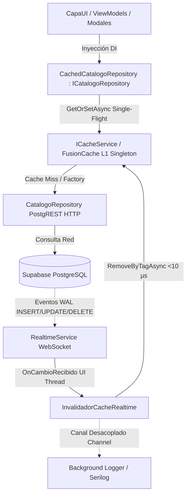

# ADR-026 — Caché en memoria con FusionCache e invalidación por Realtime

## Estado
**Propuesto** (2026-09-02).

Este registro de decisión formula el diseño técnico integral para superar y suceder formalmente a [[ADR-015 - Cache de catalogos mostrar y revalidar]]. Debido a que ADR-015 describe el comportamiento que opera actualmente en producción, permanecerá en `estado: aceptado` hasta que la implementación del presente diseño (Fases 0 a 4) sea completada, verificada en frío y desplegada en producción.

---

## 1. Contexto y Diagnóstico del Estado Actual

La aplicación de escritorio de Bimbo Honduras (.NET 8 · WPF) consume una base de datos relacional PostgreSQL alojada en la nube de Supabase a través de clientes PostgREST HTTP y WebSockets. En agosto de 2026, [[ADR-015 - Cache de catalogos mostrar y revalidar]] incorporó una caché estática en memoria (`CatalogoCache`) sustentada en el patrón *stale-while-revalidate* para optimizar la apertura de selectores y modales: la caché devuelve los elementos almacenados de inmediato (0 ms) y, en paralelo, dispara una consulta HTTP a la base de datos (`RevalidarAsync`) que refresca la interfaz gráfica mediante el delegado `alRevalidar` si se detecta alguna mutación en los registros.

A pesar de haber eliminado el bloqueo inicial de la interfaz en la apertura de modales, el diagnóstico técnico adversarial actual revela **cinco problemas estructurales y riesgos operativos**:

1. **Sobrecarga de consultas de fondo redundantes por apertura (Falla de eficiencia de Stale-While-Revalidate):**
   Cada vez que un operador abre una lupa modal (`SelectorCatalogoModal`), un formulario CRUD o la pantalla de Productos, se despacha una petición HTTP de revalidación completa a Supabase. A la escala operativa diaria de planta, **se realiza exactamente la misma cantidad de consultas a la base de datos que si no existiera caché**, consumiendo ancho de banda, conexiones en el pool de Supabase y ciclos de CPU para revalidar catálogos que raramente mutan (frecuencia de cambio de días o semanas).
2. **Fuga de datos y permisos entre sesiones en terminales compartidas ([[Deuda Técnica - Pendientes#P-048]]):**
   El proveedor de dependencias `App.Services` es un root provider estático que reside inmutable en la memoria del proceso Windows. Cuando un usuario cierra sesión en la ventana principal (`MainWindow`), la rutina de limpieza `LimpiarRecursosAsync()` nunca invoca `CatalogoCache.InvalidarTodo()`. A su vez, `RolPermisoRepository._catalogoCache` mantiene un campo estático privado con un `SemaphoreSlim` sin ningún método para purgar la memoria. Si el Usuario A (ej. Administrador) cierra sesión y el Usuario B (ej. Operador de Pesaje) inicia sesión en la misma PC sin reiniciar el ejecutable, hereda en 0 ms los catálogos y estructuras de permisos precargados por el usuario anterior.
3. **Suscripciones zombies a tablas no publicadas en Realtime ([[Deuda Técnica - Pendientes#P-049]]):**
   Pantallas como `ContactosFabricantesViewModel` y `ContactosProveedoresViewModel` heredan de `RealtimeAwareViewModel` e invocan `Observar("contactos_fabricante", ...)` y `Observar("contactos_proveedor", ...)`. Sin embargo, ninguna de estas tablas está incluida en la publicación `supabase_realtime` en PostgreSQL. El cliente de WebSocket reporta suscripción exitosa, pero la base de datos jamás emite eventos WAL hacia el socket, generando un fallo silencioso de reactividad y consumiendo canales inútilmente.
4. **Dispersión de cachés sin gobernanza arquitectónica:**
   Coexisten múltiples mecanismos aislados: `CatalogoCache` (diccionario estático en UI), `RolPermisoRepository._catalogoCache` (campo estático con semáforo en Datos) y cachés de Storage en disco local (`LogoEmpresaCache`). No existen políticas estandarizadas de tiempo de vida (TTL), control de dispersión aleatoria (*jitter*) contra estampidas (*cache stampede*), ni mecanismos de contingencia (*fail-safe*) ante caídas de red.
5. **Inexistencia de resincronización tras corte y reconexión de red:**
   En el entorno industrial de planta sujeto a microcortes de WiFi, cuando el WebSocket de Realtime restablece su conexión (`SocketState.Open` / `IConexionMonitor.Reconectado`), los catálogos en memoria no verifican si ocurrieron modificaciones durante la ventana offline, provocando que datos obsoletos persistan indefinidamente en memoria hasta el reinicio manual de la aplicación o la expiración del TTL.

---

## 2. Base Empírica de Frescura: 8 Tablas de Catálogo Publicadas en `supabase_realtime`

La viabilidad de abandonar el sondeo continuo por apertura (*stale-while-revalidate*) y migrar hacia una invalidación reactiva por eventos descansa en una verificación empírica estricta. La auditoría directa sobre el catálogo de PostgreSQL en la base de datos viva de producción (`bzmmrifjgzlvsphctais`) ejecutando:

```sql
SELECT tablename FROM pg_publication_tables WHERE pubname = 'supabase_realtime';
```

confirma con certeza absoluta que las **8 tablas de catálogo requeridas están 100% publicadas**:
- `categoria`
- `fabricante`
- `paises`
- `presentacion_producto`
- `productos`
- `proveedores`
- `tara`
- `unidad_medida`

Asimismo, la publicación incluye las tablas operativas `empleados`, `entradas_producto`, `movimiento_productos`, `movimientos` y `usuarios`.

Por el contrario, tablas como `contactos_fabricante`, `contactos_proveedor`, `bitacora`, `bitacora_pesaje`, `roles`, `acciones`, `modulos` y `empresa` **NO están publicadas**. Esta evidencia delimita con precisión matemática el perímetro de reactividad: **la invalidación reactiva por Realtime debe aplicarse estrictamente sobre las 8 tablas de catálogo verificadas**.

---

## 3. Decisión Arquitectónica

Se adopta una solución unificada de **Caché L1 en memoria** gobernada mediante la biblioteca de alto rendimiento **`ZiggyCreatures.FusionCache` versión `[2.0.2]`**, complementada con un **Invalidador Reactivo desacoplado** conectado al servicio WebSocket de `supabase_realtime`:



### Principios Rectores:
1. **Invalidación por Eventos como Garantía Primaria de Frescura:** Dado que las 8 tablas están publicadas, cualquier mutación (INSERT, UPDATE, DELETE) en cualquier terminal se propaga por WebSocket en milisegundos, disparando la invalidación por etiqueta (`RemoveByTag`) en las demás terminales conectadas.
2. **TTL y Fail-Safe como Red de Seguridad Defensiva:** El TTL evita fugas de memoria y actúa si un evento Realtime se perdiera; el Fail-Safe garantiza tolerancia a fallos ante caídas transitorias de red de planta.
3. **Retiro Definitivo de `alRevalidar`:** Se erradica el patrón *stale-while-revalidate*. Al abrir un modal, la consulta se sirve 100% desde la memoria L1 (0 ms). No se despacha ninguna consulta HTTP de revalidación en segundo plano.
4. **Patrón Decorador Transparente:** La lógica de almacenamiento en caché se extrae de los controles de UI y se encapsula en `CachedCatalogoRepository`, implementando `ICatalogoRepository`. Los ViewModels y controles consumen la abstracción de repositorio sin conocer los detalles de caché.

---

## 4. Descarte Formal y Exhaustivo de Niveles L2 (Caché Distribuida o en Disco)

Se evaluó de forma exhaustiva la incorporación de un nivel de caché secundaria (L2), ya sea distribuido (Redis / Garnet centralizado) o local persistente en disco (SQLite / motor embebido). Ambos enfoques quedan **formal y categóricamente descartados** por los siguientes motivos:

| Alternativa L2 | Riesgos Críticos y Fundamentos de Rechazo | Veredicto |
|---|---|---|
| **Redis / Garnet Centralizado** | 1. **Arquitectura sin tier intermedio:** Bimbo opera una arquitectura cliente rico de escritorio WPF directa hacia Supabase (Backend-as-a-Service). No existe un servidor de aplicaciones intermediario.<br>2. **Riesgo crítico de seguridad:** Conectar clientes de escritorio a Redis requeriría embeber cadenas de conexión o credenciales maestras en los binarios instalados en PCs de planta. Redis no soporta Row Level Security (RLS) granular como Supabase, abriendo un vector de ataque grave sobre la red corporativa.<br>3. **Complejidad y costos operativos:** Introduce un nuevo punto único de fallo, costos de infraestructura en la nube y configuración de clúster para almacenar menos de 500 KB de catálogos. | ❌ **DESCARTADO** |
| **SQLite Local / Archivos en Disco** | 1. **Persistencia de fugas entre usuarios (Agravamiento de P-048):** En terminales de pesaje compartidas por múltiples operarios, un archivo de base de datos en disco retiene registros de sesiones previas, requiriendo cifrado a nivel de archivo (SQLCipher) y saneamiento complejo que incrementa el riesgo de fuga.<br>2. **Incompatibilidad de serialización de `Result<T>`:** Toda la solución utiliza `Result<T>` (`CapaAplicacion4/Common/Result.cs`), cuyos constructores son privados y carecen de soporte nativo para deserialización con `System.Text.Json` sin serializadores a medida altamente frágiles.<br>3. **Latencia y contención de I/O:** El acceso a disco introduce contención de archivos, bloqueo de concurrencia y latencias de milisegundos, frente a los microsegundos del acceso directo por referencia en RAM (L1). | ❌ **DESCARTADO** |
| **Caché L1 en Memoria (RAM Pura)** | Los 8 catálogos completos suman menos de 500 registros y ocupan menos de 2 MB de memoria RAM. L1 opera a la velocidad de punteros de memoria (.NET CLR Heap, <10 µs), es inherentemente volátil (se purga limpiamente en logout), almacena referencias tipadas de objetos sin costo de serialización y elimina la superficie de ataque en disco o red. | ✅ **SELECCIONADO** |

---

## 5. Matriz Completa de TTL, Jitter, Fail-Safe y Zonas Zero-Cache

### 5.1 Matriz de Configuración por Familia de Datos

| Familia de Catálogo | Tablas Físicas | Tag Específico | Tag Raíz Global | TTL Base | Jitter Máx. | Fail-Safe Máx. | Throttle Fail-Safe | Modo de Invalidación |
|---|---|---|---|---|---|---|---|---|
| **Catálogos Ultra-Estables** | `paises`, `unidad_medida`, `tara` | `catalogos:paises`<br>`catalogos:unidad_medida`<br>`catalogos:tara` | `catalogos` (`TagsCache.CatalogosRaiz`) | 24 h | 30 min | 7 días | 30 s | Evento Realtime (`RemoveByTag`) + TTL de seguridad |
| **Catálogos de Negocio** | `categoria`, `fabricante`, `presentacion_producto`, `proveedores` | `catalogos:categoria`<br>`catalogos:fabricante`<br>`catalogos:presentacion`<br>`catalogos:proveedores` | `catalogos` (`TagsCache.CatalogosRaiz`) | 2 h | 15 min | 24 h | 30 s | Evento Realtime (`RemoveByTag`) inmediato |
| **Catálogo Dinámico de Productos** | `productos` (solo combos/filtros rápidos; `Total <= 200`) | `catalogos:productos` | `catalogos` (`TagsCache.CatalogosRaiz`) | 30 min | 5 min | 2 h | 15 s | Evento Realtime (`RemoveByTag`) inmediato |
| **Estructura RBAC de Permisos** | `modulos`, `acciones`, `roles` | `rbac:definiciones` | `rbac` (`TagsCache.RbacRaiz`) | 1 h | 10 min | 4 h | 30 s | Mutación en pantalla Roles o purga explícita en Logout |

#### 5.1.1 Registro Obligatorio de Tags Compuestos (Exact String Matching en FusionCache 2.0.2)
`ZiggyCreatures.FusionCache 2.0.2` implementa la indexación y comparación de etiquetas mediante **concordancia exacta de cadenas** (`exact string match`). No implementa comodines (`*`), expresiones regulares ni resolución jerárquica de prefijos por delimitadores (por ejemplo, invalidar la etiqueta `"catalogos"` **no** coincide ni invalida `"catalogos:categoria"` ni `"catalogos:paises"`).

Para posibilitar simultáneamente:
1. **Invalidación granular por tabla:** Purgar una tabla específica ante un evento Realtime puntual (ej. `RemoveByTagAsync("catalogos:paises")`).
2. **Purga global consolidada:** Purgar el conjunto completo de catálogos en una sola operación atómica tras la reconexión de red o eventos mayores (ej. `RemoveByTagAsync(TagsCache.CatalogosRaiz)` donde `TagsCache.CatalogosRaiz = "catalogos"`).

**Regla de registro mandataria:** Toda entrada de catálogo gestionada por `CachedCatalogoRepository` debe registrarse incondicionalmente asociando un array de **tags compuestos**:
```csharp
tags: new[] { TagsCache.CatalogosRaiz, $"catalogos:{nombreTabla}" }
// Donde TagsCache.CatalogosRaiz = "catalogos"
```
De este modo, cada entrada queda indexada en ambos conjuntos lógicos en memoria RAM, garantizando que tanto la invalidación granular (`"catalogos:paises"`) como la invalidación consolidada (`"catalogos"`) encuentren y expiren las entradas deseadas sin sobrecosto de búsqueda ni fallos silenciosos.

### 5.2 Delimitación Estricta de Zonas Zero-Cache (Prohibición Absoluta)

Queda **estrictamente prohibido** cachear consultas o entidades pertenecientes a los siguientes dominios operacionales:

1. **Módulo Pesaje (`movimientos`, `movimiento_productos`, `entradas_producto`, `IPesajeRepository`, `IPickerProductoRepository`):**
   Las lecturas de báscula viva, cálculos de peso neto, registro de tara y cierres de movimientos de camiones son operaciones transaccionales críticas ACID. Deben interactuar directamente con Supabase en cada llamada.
2. **Módulo Bitácora (`bitacora`, `bitacora_pesaje`, `IBitacoraRepository`):**
   Los registros de auditoría legal y eventos de seguridad deben reflejar con fidelidad cronológica el estado vivo de la base de datos sin retardos.
3. **Módulo Notificaciones (`notificaciones_usuario`, `INotificacionRepository`):**
   La bandeja de alertas e incidencias opera en tiempo real mediante RPC transaccionales y suscripciones directas por usuario.
4. **Módulo Reportería y Consultas de Cierre (`IReporteRepository`, `IReporteConsultaRepository`):**
   Los reportes financieros, de inventario y de merma deben consolidar agregaciones analíticas vivas.
5. **Sesión y Permisos del Usuario Autenticado (`IUsuarioSesionService.SesionActual`, `SesionPermisos`):**
   Los claims, privilegios y estado del usuario activo residen en su servicio de sesión en memoria y jamás deben compartirse ni almacenarse en claves globales de caché.
6. **Tablas no publicadas en Realtime (`contactos_fabricante`, `contactos_proveedor`):**
   Al carecer de eventos push, cachearlas generaría desincronizaciones silenciosas permanentes (ver [[Deuda Técnica - Pendientes#P-049]]).

---

## 6. Mitigación Exhaustiva de las Trampas del Repositorio y Ciclo de Vida (13 Trampas)

La implementación debe neutralizar con rigor de diseño las siguientes 13 trampas, enfatizando aquellas que compilan con 0 advertencias pero introducen fallas fatales o silenciosas en tiempo de ejecución:

### Trampa 1 (Error Silencioso): `ICacheService` Registrado como Singleton vs Transient
- **Mecanismo de Falla:** Si `ICacheService` se registra como `Transient` en el contenedor de dependencias, cada ViewModel o servicio que lo solicite recibirá una instancia nueva con su propio almacén `MemoryCache` vacío. Cuando un modal almacena datos, puebla su instancia efímera; cuando otro control abre, recibe una caché vacía y va a la red. La tasa de aciertos (*hit-rate*) es 0% en silencio, sin lanzar ninguna excepción.
- **Mitigación Obligatoria:** Registrar `ICacheService` estrictamente como `Singleton` en `DependencyInjection.cs`:
  ```csharp
  services.AddFusionCache(); // Registra IFusionCache como Singleton por diseño
  services.AddSingleton<ICacheService, FusionCacheService>();
  ```
  Complementar con un test unitario que verifique `Assert.Same(sp.GetRequiredService<ICacheService>(), sp.GetRequiredService<ICacheService>())`.

### Trampa 2 (Error Silencioso / Crash Catastrófico): Registro del Repositorio Concreto por Tipo vs Interfaz
- **Mecanismo de Falla:** Si `CatalogoRepository` se registra por su interfaz:
  ```csharp
  // 🔴 RECURSIÓN INFINITA:
  services.AddTransient<ICatalogoRepository, CatalogoRepository>();
  services.AddTransient<ICatalogoRepository>(sp =>
      new CachedCatalogoRepository(sp.GetRequiredService<ICatalogoRepository>(), ...));
  ```
  La llamada a `sp.GetRequiredService<ICatalogoRepository>()` dentro de la factoría se resuelve recursivamente a sí misma, agotando la pila de ejecución y disparando `StackOverflowException`. En .NET moderno, esta excepción no puede ser capturada por `try-catch`, produciendo el cierre abrupto del proceso (*crash to desktop*) sin dejar trazas en Serilog.
- **Mitigación Obligatoria:** Registrar la clase concreta `CatalogoRepository` por su tipo específico, y registrar la interfaz `ICatalogoRepository` apuntando exclusivamente al decorador:
  ```csharp
  // 🟢 REGISTRO BLINDADO:
  services.AddTransient<CatalogoRepository>();
  services.AddTransient<ICatalogoRepository>(sp =>
      new CachedCatalogoRepository(
          sp.GetRequiredService<CatalogoRepository>(),
          sp.GetRequiredService<ICacheService>()));
  ```

### Trampa 3 (Falla Silenciosa / Crash to Desktop): `CancellationToken.None` en Fábrica y Captura Defensiva de `OperationCanceledException`
- **Mecanismo de Falla (Doble Vector de Cancelación):**
  1. **Cascada de cancelación en Single-Flight:** `SelectorCatalogoModal` gobierna su ciclo de vida mediante `_ctsVida.Token`. Al cerrar el modal, se invoca `_ctsVida.Cancel()`. Si el decorador de caché pasa ese token a la consulta subyacente de Supabase dentro de la fábrica de FusionCache:
     ```csharp
     // 🔴 CANCELACIÓN EN CASCADA DE SINGLE-FLIGHT:
     await _cache.GetOrSetAsync(key, async (ctx, innerCt) => 
         await _inner.GetProductosAsync(..., ct), token: ct);
     ```
     Cuando un usuario abre y cierra el modal en 100 ms, la consulta HTTP se aborta violentamente. Debido a la protección *single-flight* de FusionCache (que fusiona solicitudes concurrentes para la misma clave), **cualquier otra pantalla que estuviera esperando ese mismo catálogo aborta con `OperationCanceledException`**, a pesar de que su propio token seguía activo.
  2. **Crash to Desktop en WPF por propagación a `async void OnLoaded`:** Cuando el modal cancela su propio `_ctsVida`, la llamada `_cache.GetOrSetAsync(..., token: ct)` detecta la cancelación del llamador y lanza legítimamente `OperationCanceledException`.
     En la arquitectura base (`RepositorioBase.cs:50`), los repositorios filtran deliberadamente esta excepción para respetar cancelaciones intencionales:
     ```csharp
     catch (Exception ex) when (ex is not OperationCanceledException)
     ```
     Por su parte, `SelectorCatalogoModal.xaml.cs:125-139` inicia la carga desde un manejador de eventos del ciclo de vida de WPF:
     ```csharp
     private async void OnLoaded(object sender, RoutedEventArgs e)
     {
         Loaded -= OnLoaded;
         await CargarInicialAsync(); // 🔴 Invocación asíncrona dentro de async void
     }
     ```
     Dado que ni `CargarInicialAsync` ni `OnLoaded` capturan `OperationCanceledException`, la excepción escapa de la máquina de estados del método `async void`. En el runtime de .NET 8 WPF, **toda excepción no controlada que escape de un método `async void` se despacha directamente al `DispatcherSynchronizationContext` de la aplicación como fatal**, produciendo el cierre inmediato y abrupto de todo el proceso de escritorio (*Crash to Desktop*) sin mostrar cuadro de diálogo ni permitir rescate en la UI.

- **Mitigación Obligatoria (Blindaje de Fábrica y Consumidor):**
  1. **Single-Flight Protegido:** La consulta subyacente a Supabase dentro de la fábrica de FusionCache debe ejecutarse siempre con `CancellationToken.None` (gobernada exclusivamente por su propio timeout de red), protegiendo a los demás hilos concurrentes.
  2. **Intercepción Defensiva en `CachedCatalogoRepository`:** El decorador de repositorio debe envolver la llamada de caché en un bloque defensivo `try-catch (OperationCanceledException)` y retornar un resultado de fallo controlado `Result.Fail("Operación cancelada")`:
     ```csharp
     public async Task<Result<PagedResult<FiltroItem>>> GetProductosAsync(
         string? termino, int page, int size, int? idProveedor, CancellationToken ct = default)
     {
         var cacheKey = $"catalogos:productos:{termino}:{page}:{size}:{idProveedor}";
         try
         {
             var items = await _cache.GetOrSetAsync(
                 cacheKey,
                 async (ctx, _) =>
                 {
                     var res = await _inner.GetProductosAsync(termino, page, size, idProveedor, CancellationToken.None);
                     if (!res.IsSuccess)
                         throw new InvalidOperationException(res.Error ?? "Error al obtener catálogo");
                     return res.Value!;
                 },
                 _optionsProductos,
                 token: ct);

             return Result<PagedResult<FiltroItem>>.Success(items);
         }
         catch (OperationCanceledException)
         {
             // 🟢 Neutralización defensiva: evita Crash to Desktop en invocaciones async void
             return Result<PagedResult<FiltroItem>>.Fail("Operación cancelada");
         }
     }
     ```
     De este modo, si el operador cierra el selector con rapidez, la tarea finaliza pacíficamente sin perturbar el contexto de sincronización de WPF ni derribar el proceso.

### Trampa 4 (Riesgo Observable de UX): Retiro de `alRevalidar` y Desaparición del Repintado en Caliente
- **Análisis de Impacto:** En ADR-015, `alRevalidar` provocaba que la grilla (`Dg.ItemsSource`) se repintara espontáneamente frente al usuario si la revalidación de fondo encontraba diferencias. Al retirar `alRevalidar`, una vez que el modal abre con los datos cacheados en memoria, la grilla no mutará mientras permanezca abierto en esa misma interacción.
- **Justificación y Mitigación:** Este es el **único cambio visual perceptible** por el usuario final. Está plenamente justificado porque el 100% de las 8 tablas están publicadas en Realtime: cualquier cambio previo ya invalidó la caché antes de que el usuario abra la lupa. La eliminación del repintado en caliente suprime el molesto parpadeo visual del `DataGrid` y elimina condiciones de carrera donde la revalidación desmarcaba el elemento que el usuario estaba seleccionando.

### Trampa 5: Detección de Tablas No Publicadas en Realtime (Mitigación P-049)
- **Mecanismo de Falla:** Si un desarrollador agrega suscripciones con `Observar()` sobre tablas no publicadas en `supabase_realtime` (ej. `contactos_fabricante` o `contactos_proveedor`), Supabase no arroja errores pero nunca emite eventos WAL, resultando en suscripciones inertes.
- **Mitigación Obligatoria:** Registrar formalmente [[Deuda Técnica - Pendientes#P-049]]. En `RealtimeService`, incorporar una lista blanca estricta con las 8 tablas publicadas o consultar la función SQL `public.tablas_publicadas_realtime()`, emitiendo una advertencia explícita en Serilog si se intenta observar una tabla no publicada.

### Trampa 6: Incompatibilidad de Serialización de `Result<T>` con `System.Text.Json`
- **Mecanismo de Falla:** `Result<T>` (`CapaAplicacion4/Common/Result.cs`) posee constructores privados inmutables sin constructor público o atributos `[JsonConstructor]`. Si se serializa a JSON o se introduce una caché L2, `System.Text.Json` falla con `NotSupportedException`. Asimismo, cachear objetos `Result.Fail(...)` tras una falla de red envenenaría la caché durante horas.
- **Mitigación Obligatoria:** Mantener la caché exclusivamente en L1 (RAM nativa de .NET CLR). El decorador desenvuelve el resultado antes de almacenar: solo se almacena `Result.Value`. Si la llamada a Supabase falla, se lanza una excepción interna para que FusionCache active su mecanismo de Fail-Safe si existe un valor previo, o propague el fallo al llamador sin persistir el error en memoria.

### Trampa 7: Aislamiento Estricto de Permisos y Sesión (Mitigación P-048)
- **Mecanismo de Falla:** Si los permisos o claims del usuario autenticado se almacenan bajo claves globales de caché, un operador que inicie sesión en la misma terminal heredará los privilegios del administrador anterior.
- **Mitigación Obligatoria:** Prohibición taxativa de cachear datos derivados de `IUsuarioSesionService.SesionActual`. Solo se permite cachear la matriz estructural de módulos y acciones del sistema bajo la clave `rbac:definiciones`. En el cierre de sesión (`MainWindow.LimpiarRecursosAsync()`), purgar determinísticamente toda la memoria de caché mediante `await _cacheService.ClearAsync(allowFailSafe: false)`.

### Trampa 8 (Falla Silenciosa y Destrucción de Fail-Safe): Resincronización tras Desconexión, Trigger de Reconexión (`SocketState.Open` vs `Reconnect`) y Tags Compuestos
- **Mecanismo de Falla (Doble Falla de Red y Tagging):**
  1. **Destrucción de Fail-Safe por trigger prematuro en `SocketState.Reconnect`:** En el SDK `Supabase.Realtime 7.0.2`, el enum `Constants.SocketState` define los estados: `Open (0)`, `Close (1)`, `Reconnect (2)` y `Error (3)`. El estado `Reconnect` se emite cuando el cliente WebSocket detecta la pérdida de conectividad física e **inicia el bucle de reintento de conexión**. En ese momento exacto, la máquina **continúa completamente desconectada de la red**. Si la purga de caché se asocia a `SocketState.Reconnect`, la memoria L1 se invalida durante el apagón de red; si un operador abre un selector en ese instante, FusionCache detecta la caché vacía e intenta invocar la factoría HTTP hacia Supabase, fallando catastróficamente con error de red en lugar de servir el valor de contingencia (*Fail-Safe*). Se destruye la resiliencia operativa en el momento preciso en que más se necesita.
  2. **Invalidez silenciosa de purga por discordancia de tags:** `ZiggyCreatures.FusionCache 2.0.2` compara etiquetas mediante igualdad estricta de cadenas (`exact string match`). Si los catálogos se almacenan exclusivamente bajo etiquetas individuales como `catalogos:categoria` o `catalogos:paises`, invocar `RemoveByTagAsync("catalogos")` busca coincidencias exactas con el literal `"catalogos"`. Al no encontrar ninguna entrada con esa cadena idéntica, FusionCache concluye habiendo purgado **0 entradas**. Los catálogos desactualizados persisten en memoria durante horas sin advertencia alguna.

- **Mitigación Obligatoria (Garantía de Resincronización Fiel):**
  1. **Disparo Exclusivo en Conexión Confirmada (`SocketState.Open` / `IConexionMonitor.Reconectado`):** La purga de resincronización debe dispararse **únicamente** cuando se confirma la transición al estado `SocketState.Open` (conexión WebSocket restablecida y canal listo) o ante el evento de histéresis verificada `IConexionMonitor.Reconectado`. Mientras el socket permanezca en `SocketState.Close`, `SocketState.Reconnect` o `SocketState.Error`, la caché L1 retiene sus datos y opera en modo Fail-Safe transparente.
  2. **Purga Consolidada mediante Tag Raíz Compuesto:** Habiendo registrado todas las entradas con el tag raíz `TagsCache.CatalogosRaiz` (`"catalogos"`), la rutina de resincronización ejecuta la purga sobre la etiqueta raíz:
     ```csharp
     // 🟢 PURGA DISPARADA EXCLUSIVAMENTE AL RESTABLECER CONEXIÓN:
     private async Task OnConexionRestablecidaAsync()
     {
         Serilog.Log.Information("Conexión restablecida. Purgando catálogos para resincronización...");
         await _cache.RemoveByTagAsync(TagsCache.CatalogosRaiz);
     }
     ```
     Esto garantiza que todas las entradas con tags `["catalogos", "catalogos:categoria"]`, `["catalogos", "catalogos:paises"]`, etc., sean invalidadas simultáneamente, forzando una lectura fresca de la base de datos solo cuando la red ya está 100% disponible.

### Trampa 9: Límites de Memoria L1 y Excepciones por `SizeLimit`
- **Mecanismo de Falla:** Si se define `SizeLimit` en `MemoryCacheOptions`, el runtime de .NET exige que **toda** entrada especifique un `Size` positivo; de lo contrario lanza `InvalidOperationException`.
- **Mitigación Obligatoria:** No configurar `SizeLimit` en `MemoryCacheOptions`. Los 8 catálogos completos ocupan menos de 2 MB de RAM en toda la aplicación. El control de memoria se implementa a nivel de diseño: **solo se cachean catálogos donde `Total <= UmbralMemoria (200)`**. Si una consulta excede 200 filas, no se cachea y se procesa mediante paginación estándar de servidor.

### Trampa 10: Anti-Stampede con Jitter en TTL
- **Mecanismo de Falla:** Si 15 terminales de planta inician turno simultáneamente a las 07:00 AM con un TTL fijo de 2 horas exactas, a las 09:00:00 AM todas expirarán a la vez, bombardeando concurrentemente a Supabase PostgREST con más de 120 peticiones simultáneas.
- **Mitigación Obligatoria:** Configurar `JitterMaxDuration` en `FusionCacheEntryOptions` (entre 5 y 15 minutos según el catálogo). FusionCache añadirá una dispersión pseudoaleatoria al vencimiento, allanando el consumo de red a lo largo del tiempo.

### Trampa 11: Armonización de Duración de Fail-Safe y Purga sin Resucitación
- **Mecanismo de Falla:** Si `FailSafeMaxDuration` es menor al TTL base, Fail-Safe queda anulado lógicamente. Si al cerrar sesión no se desactiva Fail-Safe, un fallo de red posterior podría resucitar datos de un usuario anterior.
- **Mitigación Obligatoria:** Mantener la relación armónica: TTL = 2 h, FailSafeMaxDuration = 24 h, FailSafeThrottle = 30 s. En el cierre de sesión (`MainWindow.LimpiarRecursosAsync`), invocar siempre `ClearAsync(allowFailSafe: false)`.

### Trampa 12: Concurrencia en Hilo de UI y Desacoplamiento por `Channel<T>`
- **Mecanismo de Falla:** Por contrato de `RealtimeService`, el evento `OnCambioRecibido` despacha en el hilo principal de UI (`_syncContext.Post`). Si el invalidador de caché realiza operaciones lentas (serialización de payloads, formateo de strings o escritura en disco de logs de Serilog), provocará congelamientos perceptibles (*UI freeze* o caída de FPS) en la interfaz gráfica de WPF.
- **Mitigación Obligatoria:** Dentro del callback en el hilo de UI, `InvalidadorCacheRealtime` ejecuta únicamente `_cache.RemoveByTag(tag)` (operación en RAM de microsegundos, <10 µs), y encola los datos de diagnóstico en un canal asíncrono desacoplado:
  ```csharp
  // En UI Thread:
  _cache.RemoveByTag(tag);
  _channel.Writer.TryWrite(new InvalidationLog(tabla, tag, DateTime.UtcNow));
  
  // En Background Task:
  await foreach (var log in _channel.Reader.ReadAllAsync(ct))
      Serilog.Log.Information("Caché invalidada reactivamente: {Tabla} [{Tag}]", log.Tabla, log.Tag);
  ```

### Trampa 13 (Falla Silenciosa Crítica de Ciclo de Vida): Pérdida de Suscripciones del Invalidador tras Logout (`_suscriptores.Clear()`)
- **Mecanismo de Falla:**
  En `CapaDatos/Realtime/RealtimeService.cs:244-250`, la rutina de desconexión ejecuta:
  ```csharp
  public async Task DesconectarAsync()
  {
      lock (_stateLock)
      {
          _canales.Clear();
          _suscriptores.Clear(); // 🔴 SE PURGAN TODOS LOS DELEGADOS REGISTRADOS
          _estadoHandlerRegistrado = false;
      }
      await ConexionSupabase.ResetAsync();
  }
  ```
  En la aplicación WPF, `App.Services` es un contenedor estático raíz (Root Provider) instanciado al arrancar la aplicación (`App.xaml.cs`) y **nunca se destruye ni se reconstruye** entre sesiones de usuario. Cuando el Operador A cierra su sesión en `MainWindow`, la rutina `LimpiarRecursosAsync()` invoca `await _realtimeService.DesconectarAsync()`.
  Si `InvalidadorCacheRealtime` se registra como `Singleton` en `App.Services` y realiza su suscripción únicamente en su constructor o durante el arranque inicial, `_suscriptores.Clear()` elimina incondicionalmente todos sus manejadores del diccionario interno de `RealtimeService`.
  Cuando el Operador B inicia sesión en la misma máquina física, `InvalidadorCacheRealtime` ya existe en memoria (su constructor no vuelve a ejecutarse). Como resultado, el diccionario `_suscriptores` queda permanentemente desprovisto de los observadores del invalidador.
  A partir del segundo inicio de sesión en cualquier terminal compartida de planta, la aplicación **pierde el 100% de la invalidación reactiva por Realtime** en silencio absoluto, sin lanzar excepciones ni registrar advertencias. La caché en memoria L1 continuará sirviendo datos viejos durante horas hasta la expiración del TTL, anulando el beneficio central de ADR-026 en el escenario operativo principal de Bimbo Honduras (terminales compartidas en turnos rotativos).

- **Mitigación Obligatoria (Gestión Explícita del Ciclo de Vida de Suscripción):**
  1. **Método `Suscribir()` Explícito e Idempotente:** `InvalidadorCacheRealtime` debe exponer un método público `Suscribir()` que registre (o re-registre de forma idempotente) las suscripciones a las 8 tablas de catálogo en `RealtimeService`:
     ```csharp
     public void Suscribir()
     {
         // Registra los manejadores para las 8 tablas de catálogo publicadas
         foreach (var tabla in TablasCatalogosPublicadas)
         {
             _realtimeService.Observar(tabla, OnCambioRealtime);
         }
     }
     ```
  2. **Invocación Mandataria en `MainWindow.OnLoaded`:** En cada ciclo de vida de sesión en `MainWindow.xaml.cs` (dentro de `OnLoaded` o al inicializar los servicios tras autenticación exitosa), se debe resolver e invocar explícitamente:
     ```csharp
     var invalidador = App.Services.GetRequiredService<IInvalidadorCacheRealtime>();
     invalidador.Suscribir();
     ```
  3. **Preservación Alternativa en Infraestructura:** Como salvaguarda complementaria en `RealtimeService`, se recomienda desacoplar internamente el ciclo de vida de los canales efímeros de transporte (`_canales.Clear()`) del registro de suscriptores permanentes de nivel de aplicación (`SingletonAppSubscribers`), asegurando que observadores globales de infraestructura sobrevivan a la desconexión o se re-conecten formalmente ante cada nueva sesión autenticada.

---

## 7. Selección y Verificación Rigurosa de Dependencias NuGet

Para dar cumplimiento formal al requerimiento R3, se auditó exhaustivamente la matriz de versiones de NuGet y el árbol de dependencias transitivas de `BimboProyecto` (.NET 8 LTS):

- **Paquete Seleccionado:** **`ZiggyCreatures.FusionCache` versión `[2.0.2]`**
- **Plataforma Target:** `net8.0` / `net8.0-windows`
- **Dependencia Transitiva Estricta:**
  ```xml
  <dependencies>
    <group targetFramework="net8.0">
      <dependency id="Microsoft.Extensions.Caching.Memory" version="8.0.1" exclude="Build,Analyzers" />
    </group>
  </dependencies>
  ```
- **Conformidad de Ecosistema:**
  1. No introduce ninguna dependencia en `Microsoft.Extensions.*` de la línea `9.x` (las versiones 2.1.0 a 2.7.2 de FusionCache arrastran dependencias obligatorias a .NET 9).
  2. Es la última versión LTS pura declarada oficialmente por el autor de la biblioteca para proyectos .NET 8 corporativos.
  3. Provee soporte nativo y completo para:
     - Tagging e invalidación por etiquetas (`RemoveByTag` / `RemoveByTagAsync`).
     - Purga total en logout con desactivación de Fail-Safe (`ClearAsync(allowFailSafe: false)`).
     - Coalescencia de peticiones en vuelo único (*Single-Flight Request Coalescing*).
     - Dispersión aleatoria de expiración (*Jitter*).
     - Modo de contingencia ante fallos (*Fail-Safe*).

En la Fase 1 de implementación, la referencia se agregará en `CapaDatos/CapaDatos.csproj`:
```xml
<ItemGroup>
  <PackageReference Include="ZiggyCreatures.FusionCache" Version="2.0.2" />
</ItemGroup>
```

---

## 8. Roadmap de Implementación en 5 Fases

| Fase | Denominación y Alcance | Entregables Concretos | Criterio de Término Medible |
|---|---|---|---|
| **Fase 0** | **Preparación y Contratos** | - Incorporar `ZiggyCreatures.FusionCache [2.0.2]` en `CapaDatos.csproj`.<br>- Definir contratos `ICacheService` y constantes canónicas `TagsCache` (`TagsCache.CatalogosRaiz = "catalogos"`, tags por tabla) en `CapaAplicacion4`.<br>- Validar compatibilidad de compilación contra el árbol .NET 8. | `dotnet build` finaliza con 0 errores y 0 advertencias de dependencias. |
| **Fase 1** | **Infraestructura Central de Caché** | - Implementar `FusionCacheService : ICacheService` registrado como Singleton en DI.<br>- Implementar `InvalidadorCacheRealtime` exponiendo el método explícito e idempotente `Suscribir()`, despacho síncrono ultrarrápido (<10 µs en UI Thread) y desacoplamiento de logs por `Channel<T>`.<br>- Crear suite de pruebas unitarias en `BimboProyecto.Tests` para Single-Flight, Jitter, Fail-Safe, Tagging exacto con tags compuestos y neutralización de `OperationCanceledException`. | 100% de pruebas unitarias de infraestructura de caché superadas satisfactoriamente. |
| **Fase 2** | **Migración de Catálogos CRUD** | - Implementar decorador `CachedCatalogoRepository : ICatalogoRepository` con:<br>  * Registro de tags compuestos: `tags: new[] { TagsCache.CatalogosRaiz, $"catalogos:{nombreTabla}" }`.<br>  * Factoría interna con `CancellationToken.None` (protección single-flight).<br>  * Captura defensiva de `OperationCanceledException` retornando `Result.Fail("Operación cancelada")` para inmunizar las llamadas `async void OnLoaded` de los modales.<br>- Sustituir llamadas estáticas a `CatalogoCache` por `ICatalogoRepository` en ViewModels y modales.<br>- Retirar el delegado `alRevalidar` y simplificar `SelectorCatalogoModal`. | Apertura de modal en 0 ms sin generar consultas HTTP secundarias en aperturas repetidas y cierre rápido sin excepciones. |
| **Fase 3** | **Saneamiento de Sesión y Deuda Técnica** | - Integrar `_cacheService.ClearAsync(allowFailSafe: false)` en `MainWindow.LimpiarRecursosAsync()` (resolución [[Deuda Técnica - Pendientes#P-048]]).<br>- Integrar invocación obligatoria de `InvalidadorCacheRealtime.Suscribir()` en `MainWindow.OnLoaded` en cada nueva sesión de usuario, neutralizando la pérdida de suscriptores provocada por `_suscriptores.Clear()` en logout.<br>- Refactorizar `RolPermisoRepository._catalogoCache` para usar `ICacheService` bajo el tag `rbac:definiciones`.<br>- Resolver o desuscribir `Observar()` en `ContactosFabricantesViewModel` y `ContactosProveedoresViewModel` (resolución [[Deuda Técnica - Pendientes#P-049]]). | Cero persistencia de datos o permisos en memoria tras cerrar sesión e iniciar con otro usuario; reactividad por Realtime operativa al 100% en todos los logins sucesivos. |
| **Fase 4** | **Resincronización, Telemetría y Cierre** | - Implementar purga total de catálogos (`_cache.RemoveByTagAsync(TagsCache.CatalogosRaiz)`) activada **estrictamente ante la transición confirmada a `SocketState.Open`** (conexión restablecida) o mediante el evento `IConexionMonitor.Reconectado` (prohibiendo su ejecución prematura en `SocketState.Reconnect`).<br>- Conectar métricas de acierto/fallo (*hit/miss ratio*) a Serilog.<br>- Actualizar la bóveda Obsidian marcando formalmente ADR-015 como superado. | Desconexión forzada de red y posterior reconexión restaura la consistencia al 100% sin excepciones ni caídas del fail-safe durante el apagón. |

---

## 9. Consecuencias de la Decisión

### Positivas
- **Apertura instantánea garantizada (0 ms):** Todos los selectores de catálogos y combos cargan de inmediato desde la memoria RAM sin latencia de red ni esperas de sondeo.
- **Reducción masiva de carga en Supabase:** Se eliminan cientos de consultas HTTP redundantes generadas diariamente por el anterior *stale-while-revalidate* en cada apertura de selector.
- **Consistencia reactiva multiusuario:** Cualquier alta, baja o modificación de catálogos se propaga por WebSocket en milisegundos, invalidando la memoria L1 antes de que el usuario abra la pantalla en otra PC.
- **Erradicación de fuga de datos multiusuario (P-048):** La purga determinística en `MainWindow.LimpiarRecursosAsync()` asegura que operadores y supervisores en una misma terminal física jamás compartan datos cacheados en memoria.
- **Resiliencia operativa industrial:** La capacidad Fail-Safe de FusionCache permite a los operarios seguir consultando catálogos en contingencia durante microcortes transitorios de la red de planta.

### Negativas / Riesgos Aceptados y Mitigados
- **Dependencia externa adicional:** Se incorpora la biblioteca `ZiggyCreatures.FusionCache`, mitigada mediante la selección fijada de la versión `[2.0.2]` confinada estrictamente en `Microsoft.Extensions.Caching.Memory 8.0.1`.
- **Desaparición del repintado en caliente:** Se asume que el `DataGrid` de un modal abierto no mutará espontáneamente si otro usuario edita un registro mientras el modal permanece abierto en esa interacción de 3 segundos, lo cual previene el parpadeo visual y pérdidas de selección.
- **Riesgo de corte de WebSocket y resincronización:** Mitigado por la política de reconexión que purga obligatoriamente la etiqueta raíz consolidada `TagsCache.CatalogosRaiz` al confirmar la transición a `SocketState.Open` o `IConexionMonitor.Reconectado` (sin ejecutar prematuramente en `SocketState.Reconnect`), y por el TTL de seguridad base de 2 horas.

---

## Relaciones

- [[Arquitectura Actual]] — MOC y estado vivo del sistema donde se integra esta propuesta
- [[ADR-015 - Cache de catalogos mostrar y revalidar]] — decisión previa vigente en producción que será sucedida por este ADR tras su implementación
- [[Deuda Técnica - Pendientes]] — registro de deudas técnicas directamente resueltas (P-048 y P-049) y relacionadas (P-034)
- [[Conocimiento Principal]] — índice maestro de la base de conocimiento de la bóveda
- [[Módulo Productos]] — principal consumidor de selectores de catálogos en la aplicación
- [[Gestor Realtime - Diseño Arquitectónico]] — infraestructura de WebSockets sobre la que se fundamenta la invalidación reactiva
