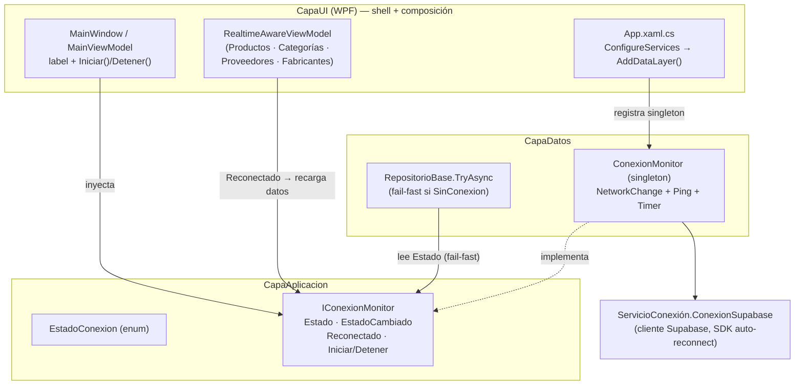
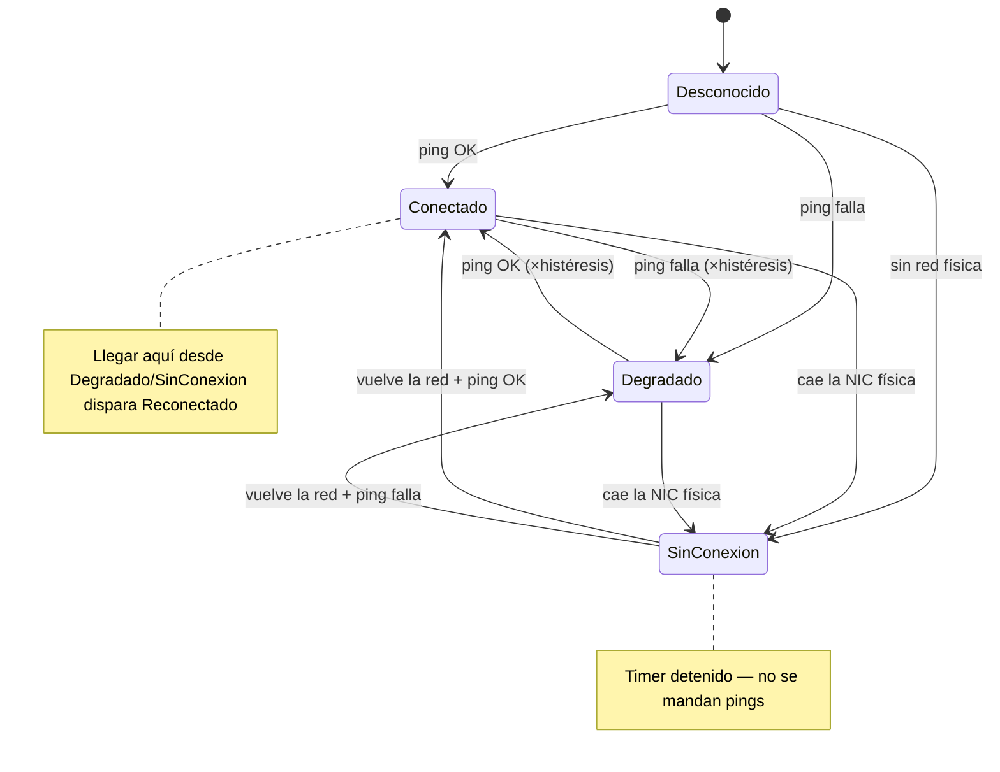
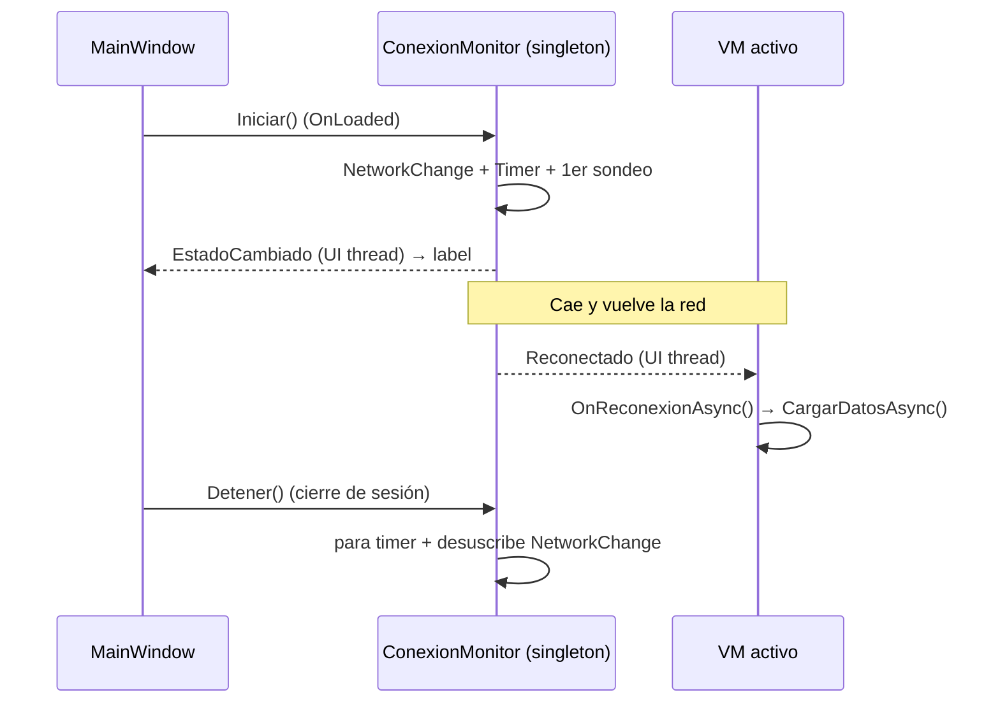

# Detector / Monitor de Conexión

> [!abstract] Resumen
> Servicio que vigila la red de forma continua **mientras hay sesión iniciada** y publica
> uno de cuatro estados de conectividad. Sirve de base para que el resto de la app reaccione
> a cortes de internet sin esperar timeouts, manteniendo el modelo **online-first** sobre
> Supabase y dejando el terreno listo para un futuro modo **offline con SQLite**.
>
> El login sigue siendo **obligatoriamente online**; el monitor solo actúa una vez dentro.

---

## 1. Estados

| Estado interno (`EstadoConexion`) | Label (UI) | Color | Significado |
|---|---|---|---|
| `Desconocido` | "Verificando…" | gris `#9CA3AF` | Estado inicial, antes del primer sondeo |
| `Conectado` | "Conectado" | verde `#10B981` | Hay interfaz física y el ping llega en tiempo y forma |
| `Degradado` | "Sin internet" | ámbar `#F59E0B` | Hay interfaz física (cable/Wi-Fi) pero el ping no llega o tarda demasiado |
| `SinConexion` | "Sin conexión" | rojo `#EF4444` | No hay ninguna interfaz de red física operativa |

---

## 2. Arquitectura

Replica el patrón ya existente de `IRealtimeService` / `RealtimeService`:
**contrato en `CapaAplicacion`, implementación *singleton* en `CapaDatos`, registro en `AddDataLayer()`**.



> [!info] Regla de capas
> `CapaAplicacion` **nunca** referencia `CapaDatos`. El monitor invierte la dependencia:
> la implementación (`CapaDatos`) cumple el contrato (`IConexionMonitor`) definido en `CapaAplicacion`.

### Registro en DI (`CapaDatos/DependencyInjection.cs`)

```csharp
// Monitor de conexión — singleton: una sola vigilancia de red para toda la app
services.AddSingleton<IConexionMonitor, ConexionMonitor>();
```

---

## 3. Algoritmo de detección

### 3.1 Detección de red física — `HayRedFisica()`

> [!warning] Problema que resuelve
> `NetworkInterface.GetIsNetworkAvailable()` devuelve `true` cuando hay **cualquier** adaptador
> "Up" que no sea loopback. En una PC con Hyper-V / VMware / VirtualBox / WSL / Docker, esos
> adaptadores **virtuales** siguen "Up" aunque apagues el Wi-Fi → el monitor creía que había red,
> intentaba ping, fallaba y reportaba **Degradado** en vez de **Sin conexión**.

La detección correcta solo cuenta una interfaz que cumpla **todo**:

1. `OperationalStatus == Up`.
2. Tipo `Ethernet` o `Wireless80211` (cable o Wi-Fi reales).
3. **No** ser virtual (se descarta por nombre/descripción: `virtual`, `vmware`, `hyper-v`,
   `vethernet`, `virtualbox`, `loopback`, `pseudo`, `tap`, `tunnel`, `wsl`, `docker`).
4. Tener un **gateway IPv4 real** (descarta host-only y APIPA `169.254.x.x`).

Si la enumeración falla, hace *fallback* al chequeo básico del SO.

```csharp
private static bool HayRedFisica()
{
    try
    {
        foreach (var ni in NetworkInterface.GetAllNetworkInterfaces())
        {
            if (ni.OperationalStatus != OperationalStatus.Up) continue;
            if (ni.NetworkInterfaceType is not (NetworkInterfaceType.Ethernet
                                              or NetworkInterfaceType.Wireless80211)) continue;

            var desc = (ni.Description + " " + ni.Name).ToLowerInvariant();
            if (/* contiene "virtual","vmware","hyper-v","vethernet","virtualbox",
                   "loopback","pseudo","tap","tunnel","wsl","docker" */ EsVirtual(desc)) continue;

            var props = ni.GetIPProperties();
            bool tieneGateway = props.GatewayAddresses.Any(g =>
                g?.Address is { } ip
                && ip.AddressFamily == AddressFamily.InterNetwork
                && !ip.Equals(IPAddress.Any));
            if (tieneGateway) return true;
        }
        return false;
    }
    catch { return NetworkInterface.GetIsNetworkAvailable(); }
}
```

### 3.2 Sondeo ICMP — `SondearAsync()`

Decisión del proyecto: **ping ICMP** a IPs públicas (configurables). Aislado en su propio método
para poder migrar a una sonda HTTP a Supabase en el futuro sin tocar el resto.

- Recorre los *targets* (por defecto `1.1.1.1`, `8.8.8.8`); el **primero que responde** ⇒ `Conectado`.
- `reply.Status == Success` y `RoundtripTime ≤ timeout` ⇒ éxito.
- Ningún target responde ⇒ fallo ⇒ `Degradado`.
- Cada ping usa `using var ping = new Ping();` → se libera de inmediato.

> [!caution] Caveat de ICMP
> Algunas redes corporativas / Wi-Fi bloquean ICMP. Ahí el monitor podría reportar `Degradado`
> aunque el HTTPS de Supabase sí funcione. Los *targets* y umbrales viven en `App.config` para
> ajustarlos sin recompilar; si aparece ese caso, se migra a sonda HTTP.

### 3.3 Cadencia — *event-driven* + adaptativa

- Se suscribe a `NetworkChange.NetworkAvailabilityChanged` y `NetworkAddressChanged`.
- **Sin red física** ⇒ estado `SinConexion` y **el timer se detiene** (cero pings sin cable/Wi-Fi).
- **Con red física** ⇒ sondea de inmediato y arranca un timer auto-reprogramado:
  - `5000 ms` cuando está `Conectado`.
  - `3000 ms` cuando está `Degradado` (detecta la recuperación más rápido).
- Un guard `Interlocked` evita sondeos solapados.

### 3.4 Histéresis

Para que el label **no parpadee**, se exigen **N mediciones de ping iguales seguidas**
(`CONEXION_HISTERESIS`, por defecto `2`) antes de cambiar el estado publicado.
La caída de NIC física es determinista, así que `SinConexion` se aplica **sin histéresis** (inmediato).

### 3.5 Máquina de estados



### 3.6 Threading

Captura el `SynchronizationContext` del hilo de UI en el constructor (igual que `RealtimeService`)
y **despacha los eventos `EstadoCambiado` / `Reconectado` en el UI thread**. El sondeo corre en
*background*. Si el contexto es nulo, avisa por Serilog.

---

## 4. Ciclo de vida y gestión de recursos (sin fugas)

> [!success] Todo se libera al terminar su ciclo
> No se acumulan timers, handlers ni objetos entre sesiones.

| Componente | Vida | Cómo se libera |
|---|---|---|
| `ConexionMonitor` | singleton | **Un solo** `Timer` reusado (`??=`), liberado en `Dispose()` (cierre de app). Handlers de `NetworkChange` se sueltan en `Detener()`. `Ping` con `using` por sondeo. |
| `Iniciar()` / `Detener()` | por sesión | Idempotentes (guards). `Iniciar()` en `MainWindow.OnLoaded`; `Detener()` en el cierre de sesión, junto a `RealtimeService.DesconectarAsync()`. |
| `MainViewModel` | por sesión | Se suscribe a `EstadoCambiado` en el ctor y **se da de baja en `Dispose()`**. |
| `RealtimeAwareViewModel` (VMs) | por vista | Se suscribe a `Reconectado` en el ctor y se da de baja en `Dispose()` (que la vista llama en `Unloaded`). El singleton **nunca retiene** VMs muertos. |
| Repositorios | transitorios | Solo referencian al monitor; sin referencia de vuelta → se recolectan normalmente. |



---

## 5. Integración con el resto de la app

### 5.1 Label en el shell (MVVM)

`MainViewModel` expone `EstadoTexto` y `EstadoBrush` (propiedades calculadas con `Brush` *frozen*),
actualizadas al recibir `EstadoCambiado`. En `MainWindow.xaml` hay una *pill* (punto de color + texto)
**arriba a la izquierda** del top bar.

```csharp
public string EstadoTexto => Conectividad switch {
    EstadoConexion.Conectado   => "Conectado",
    EstadoConexion.Degradado   => "Sin internet",
    EstadoConexion.SinConexion => "Sin conexión",
    _                          => "Verificando…"
};
```

### 5.2 Fail-fast en repositorios

El *chokepoint* único de todos los CRUD es `RepositorioBase.TryAsync(...)`. Si el monitor está en
`SinConexion`, **corta de inmediato** (sin intentar el HTTP, evita el hang del timeout):

```csharp
if (_conexion.Estado == EstadoConexion.SinConexion)
    return Result<T>.Fail("Sin conexión a internet.");
```

> [!note] Solo corta en `SinConexion`, no en `Degradado`
> En `Degradado` sí se intenta, porque muchas redes bloquean ICMP pero el HTTPS de Supabase
> funciona — cortar ahí daría falsos "offline".

`SupabaseRepository` (buscador universal) se desacopló de `RepositorioBase` para no arrastrar el
guard donde no aplica.

### 5.3 Recarga al reconectar (en los ViewModels)

Supabase Realtime re-suscribe al reconectar, pero **pierde los eventos ocurridos durante la caída**.
Por eso `RealtimeAwareViewModel`:

- Se suscribe a `Reconectado` → llama `OnReconexionAsync()` (virtual, *no-op* por defecto).
- Cada VM de datos lo sobrescribe con `CargarDatosAsync()` (recarga total).
- `Observar(tabla, handler)` es **idempotente por tabla** → recargar **no duplica** suscripciones Realtime.

Como solo vive el VM de la **vista activa** (los demás se liberan al navegar), efectivamente
"se refresca la vista activa" al volver la conexión.

---

## 6. Configuración (`App.config`)

> [!danger] `CapaUI/App.config` está en `.gitignore`
> Contiene la `SUPABASE_KEY`, por lo que **no se versiona**. Las claves de abajo son **opcionales**:
> si faltan, el código usa los *defaults*. Hay que añadirlas manualmente en cada equipo si se
> quieren personalizar.

| Clave | Default | Descripción |
|---|---|---|
| `CONEXION_PING_TARGETS` | `1.1.1.1,8.8.8.8` | IPs a pinguear (la primera que responde ⇒ Conectado) |
| `CONEXION_PING_TIMEOUT_MS` | `1500` | Timeout por ping |
| `CONEXION_INTERVALO_OK_MS` | `5000` | Intervalo de sondeo estando Conectado |
| `CONEXION_INTERVALO_DEGRADADO_MS` | `3000` | Intervalo de sondeo estando Degradado |
| `CONEXION_HISTERESIS` | `2` | Mediciones iguales seguidas para cambiar de estado |

---

## 7. Archivos

### Nuevos
- `CapaAplicacion4/Conexion/EstadoConexion.cs` — el enum.
- `CapaAplicacion4/Conexion/IConexionMonitor.cs` — el contrato.
- `CapaDatos/Conexion/ConexionMonitor.cs` — la implementación singleton.

### Modificados
- `CapaDatos/DependencyInjection.cs` — registro del singleton.
- `CapaDatos/Repositories/RepositorioBase.cs` — ctor con monitor + `TryAsync` con fail-fast.
- `CapaDatos/Repositories/Search/SupabaseRepository.cs` — desacople de `RepositorioBase`.
- `CapaDatos/Repositories/{Productos,Categorias,Proveedores,Fabricantes}/*CrudRepository.cs` — ctor que pasa el monitor.
- `CapaUI/Core/MVVM/RealtimeAwareViewModel.cs` — `Reconectado` → `OnReconexionAsync`, `Observar` idempotente.
- `CapaUI/Formularios/Principal/MainViewModel.cs` — label de estado.
- `CapaUI/Formularios/Principal/MainWindow.xaml(.cs)` — pill + `Iniciar()`/`Detener()`.
- `CapaUI/.../Pantallas/{Productos,Categorias,Proveedores,Fabricantes}/*ViewModel.cs` — ctor + override de recarga.
- `CapaUI/App.config` — claves `CONEXION_*` *(no versionado)*.

---

## 8. Decisiones de diseño y trade-offs

- **ICMP vs HTTP:** se eligió ICMP (decisión del proyecto). Aislado tras `SondearAsync()` para
  migrar a HTTP-a-Supabase si las redes que bloquean ICMP dan problemas.
- **Fail-fast solo en `SinConexion`:** evita falsos "offline" en redes que bloquean ICMP pero
  permiten HTTPS.
- **Recarga en el VM (no re-navegación del shell):** más robusto y sin *flicker*; el VM posee
  el ciclo de datos. `Observar` idempotente evita suscripciones duplicadas.
- **Log de transiciones a nivel `Warning`:** para que sean visibles bajo el `MinimumLevel.Warning`
  actual de Serilog sin tocar `App.xaml.cs`.
- **No se desconecta Realtime manualmente:** el SDK de Supabase gestiona su propia reconexión.

---

## 9. Cómo probar (verificación manual)

1. Iniciar sesión → el label arranca en "Verificando…" y pasa a **Conectado** (verde).
2. Apagar el Wi-Fi / quitar el cable → **Sin conexión** (rojo); en los logs, el ping **se detiene**.
3. Con un form abierto, sin red, abrir otra sección → **"Sin conexión a internet." al instante**
   (sin esperar el timeout).
4. Router sin salida a internet (ICMP falla) → **Sin internet** (ámbar, `Degradado`).
5. Reconectar → vuelve a **Conectado** y la vista de datos se **recarga sola**.
6. Logs en `%AppData%\BimboPesaje\Logs\app-*.log` → cada transición queda registrada.

---

## 10. Limitaciones conocidas y futuro

- **Modo offline (SQLite):** fuera de alcance. La infraestructura de eventos de este monitor es
  justo el disparador que esa fase futura necesitará.
- **Suscripción Realtime abierta estando offline:** si una vista se abre **durante** la caída,
  la recarga al reconectar sí trae datos frescos, pero la suscripción Realtime de esa tabla podría
  no re-establecerse hasta re-navegar (caso borde; `Observar` idempotente prioriza no duplicar).
- **Adaptadores virtuales con NAT/gateway:** un switch virtual con gateway podría considerarse
  "red física"; cubierto parcialmente por la exclusión por nombre.
- **`App.config` no versionado:** las claves `CONEXION_*` deben replicarse por equipo (o usar defaults).

---

> [!quote] Relacionado
> Patrón espejo: `IRealtimeService` / `RealtimeService` (suscripciones Realtime de Supabase).

## Relaciones

- [[Arquitectura Actual]]
- [[Base Repository con TryAsync]] — patrón espejo de manejo de fallos de red
